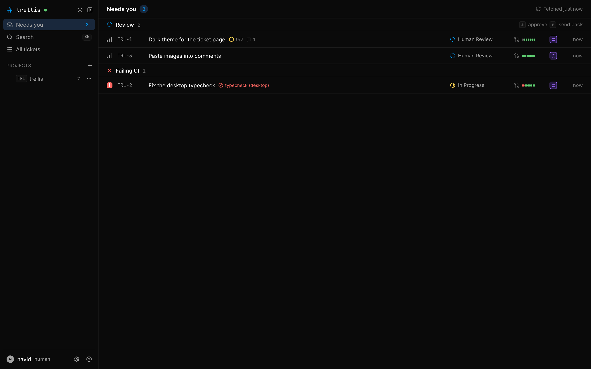
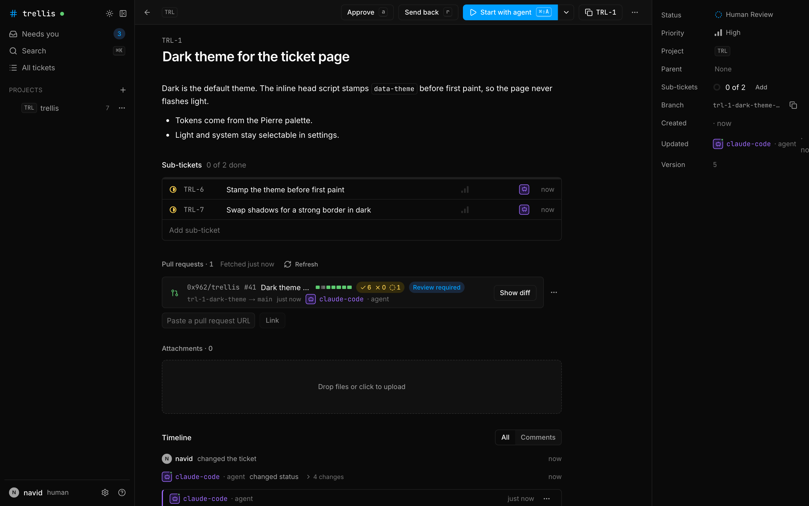
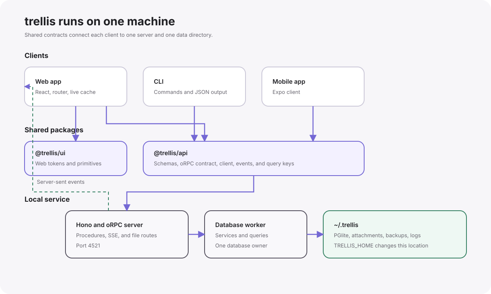

# trellis



## What it is

trellis is a local ticket tracker for work that humans give to coding agents. One server on your machine stores:

- projects and tickets
- attachments
- linked pull requests and their CI results

Agents use the `trellis` CLI or the HTTP API. Each write records the name of the actor that made it. You use the desktop app, the web app, or the mobile app on your phone. An agent can move a ticket to review. Only a human can move a ticket to Done.

[docs/ARCHITECTURE.md](docs/ARCHITECTURE.md) describes the stack, the domain rules, the schema, and the API.

## macOS desktop preview

The desktop includes Bun, Node, a local host, and a separate execution runtime. Native ticket work uses Git and the selected agent executable.
The ticket work area shows agent output, local changes, checks, artifacts, and required decisions.

Use **Settings > Desktop > Choose data directory** to open an existing Trellis home, such as `~/.trellis`, in place.
The confirmation shows the current directory, selected directory, and backup path.
The desktop disables the matching standalone service, backs up the database, and starts with automation paused.
Both data directories keep their files. The macOS window uses native controls in the app title bar.

Read [the desktop guide](apps/desktop/README.md) to build the app and select its data directory.
The [implementation report](docs/desktop/implementation-status.md) records the real ticket result, package checks, and open release gates.
Developer ID signing and notarization remain unverified.

## Install the standalone server

trellis needs [Bun](https://bun.sh) 1.3. The launchd service needs macOS. To see pull requests and CI, install `gh` and run `gh auth login`.

Version 0.1 publishes no package. The CLI installs from a clone, and the clone stays on disk, because the installed command and the launchd service run the server from it.

```sh test skip
git clone https://github.com/0x962/trellis.git
cd trellis
bun install
```

Run the install command one time from the clone:

```sh
bun packages/cli/src/index.ts install
```

`trellis install` does these steps:

1. It builds the web app into `apps/web/dist`.
2. It writes the `trellis` command to `~/.local/bin/trellis`. Add `~/.local/bin` to your `PATH`.
3. It writes the launchd agent `~/Library/LaunchAgents/com.trellis.server.plist`. The agent starts the server at login and starts it again after a crash.
4. It adds the `trellis` route to the gateway routes file.
5. It loads the agent with `launchctl`, waits until `http://127.0.0.1:4521/api/health` answers, and prints the server URL.

`--no-launchd` writes the files and loads nothing. `trellis uninstall` removes the agent and the command.

`trellis gateway` on port 80 serves `http://trellis.localhost` when it reads the routes file `~/.config/localhost-gateway/routes.json`. The file maps each `*.localhost` name to a port, as in `{ "trellis": 4521 }`. `trellis install` sets the `trellis` entry and keeps the others, and `trellis uninstall` removes it. When no gateway answers for `trellis.localhost`, install prints `http://127.0.0.1:4521` and the path of the routes file.

To run the server in the foreground and not as a launchd agent, run this command in a separate terminal:

```sh test background
trellis serve
```

## Daily use

Open `http://127.0.0.1:4521`. With the optional gateway, open `http://trellis.localhost`. On the first visit, the setup page asks for your name and your first project.

Create a project and a ticket from the CLI:

```sh test
trellis projects create --key TRL --name trellis
```

```sh test
trellis create -p TRL -t "Write the README"
```

In a terminal, the CLI prints aligned text. When you pipe the output or pass `--json`, the CLI prints JSON:

```sh test
trellis list --project TRL --json
```

### The pages

`/` sends you to Needs you. The sidebar holds Needs you, Search, Flows, Loops,
Usage, the sessions, and the project tree. Each project lists its Tickets,
Diffs, and Sessions pages. The three-dots menu of a project opens its
Settings page.
A session is a scratch git repository with one agent, outside every project.
The New session button in the sidebar starts one from a prompt.

| Path | Page |
|---|---|
| `/needs-you` | Needs you: the page title over an empty body |
| `/p/TRL` | The board of a project, which is the view a project opens in |
| `/p/TRL/table` | The table of the same project |
| `/p/TRL/web/auth` | The board of the sub-project `auth` under `web` |
| `/p/TRL/diffs` | The pull requests of a project |
| `/p/TRL/settings` | The settings of a project |
| `/t/TRL-42` | One ticket |
| `/sessions/<id>` | One session: the terminal of its agent and the process controls |
| `/search` | Search |
| `/usage` | Subscription quota, token cost per day, and a breakdown by ticket, agent, project, kind, account, model, or harness |
| `/settings` | The settings |
| `/setup` | The first visit, and the new project step |

The URL keeps slashes between project segments, and the API ref joins the same
segments with dots: the page `/p/TRL/web/auth` reads the project `TRL.web.auth`.
A link that ends in `/board` still opens the board, with the segment dropped.
`board`, `settings`, `notes`, and `diffs` are reserved, so no sub-project takes one of those slugs.

Press `g b` for the board and `g t` for the table. The view switch in the topbar
does the same.



The ticket page shows:

- the description and the sub-tickets
- each linked pull request with its check ribbon
- the attachments
- the run of the assigned agent, with a form that sends the agent a message
- a properties rail with the status, the priority, the parent, and the agents of the ticket

To link a pull request to the ticket, paste its URL on the ticket page or run `trellis pr add <ticket> <url>`. The first prompt of an assigned agent tells the agent to run that command.

### The diff viewer

Each pull request carries a Show diff control that opens its native Trellis review page. The Diffs page of a project lists the pull requests of the project and also accepts a GitHub PR URL. The page supports split and unified diffs, local threads, replies, reactions, and review submissions with agent notifications.

Read [Local pull request reviews](docs/reviews.md) for the CLI and review workflow.

### Keyboard map

`Cmd` is `Ctrl` outside macOS. `packages/api` holds no key map. The one map
is `apps/web/src/lib/shortcuts.ts`.

| Keys | Scope | Action |
|---|---|---|
| `Cmd+K` | Global | Open the command palette |
| `/` | Global | Search tickets |
| `c` | Global | New ticket |
| `g h`, `g p` | Global | Go to Needs you or a project |
| `g b`, `g t` | Global | Switch to the board or the table |
| `g s` | Global | Focus the filter bar |
| `[` | Global | Collapse or expand the sidebar |
| `Cmd+\` | Global | Switch between dark and light |
| `Escape` | Global | Close the popover, then the peek, then clear the selection |
| `j`, `k` | List | Move to the row below or the row above |
| `Enter`, `Space` | List | Open the peek |
| `o` | List | Open the full page |
| `x` | List | Select or clear the row |
| `Shift+J`, `Shift+K` | List | Extend the selection |
| `s`, `p`, `m` | List | Change the status, the priority, or the project |
| `Shift+P` | List | Set the parent |
| `Backspace` | List | Delete the ticket |
| `1` to `9` | List | Collapse or expand a group |
| `[`, `]` | Board | Move the ticket one column left or right |
| `e` | Ticket | Edit the description |
| `Cmd+C`, `Cmd+Shift+C` | Ticket | Copy the ID or the branch name |
| `Cmd+.`, `Cmd+Shift+B` | Ticket | Copy the link or the agent brief |
| `Cmd+Enter` | New ticket | Submit the form |
| `Cmd+Shift+Enter` | New ticket | Create and keep the form open |

## Agents

Run `trellis instructions --project TRL` to print the workflow block below. Paste the block into the `AGENTS.md` file of the repository that the agent works in. The [agent setup guide](docs/agents.md) has the actor rules and the Done rule.

Every write sends the header `x-trellis-actor: <human|agent>:<name>`. The CLI sets the header. Inside Claude Code, every command runs as `agent:claude-code`. Elsewhere, `TRELLIS_ACTOR` or `--as` sets the actor. `trellis whoami` prints how the CLI chose the actor.

### Agent runs

A ticket has zero or one assigned agent. An assignment selects its harness,
model, and effort. The assignment stays with the ticket across status changes
and process exits. A person removes it before another agent can take the ticket.

The Agent section of the ticket rail shows the assigned agent. Its dialog selects the harness, model, and effort.
The model picker searches the catalog and groups models by family.
The agent profile mark uses the model provider icon. Hover over the mark to see the model and effort.

A run carries one state: `starting`, `running`, `interrupted`, `failed`,
`stopped`, or `exited`. A failed launch stays visible with its error. A stop
closes the terminal, and keeps the workspace, the history, and the final output.

### The agent CLI

| Command | Purpose |
|---|---|
| `trellis agents list` | List the runs. `--ticket` and `--project` narrow the list. |
| `trellis agents start --ticket <ticket> --harness <preset>` | Assign a ticket agent. `--model` and `--effort` select its configuration. |
| `trellis agents refresh <id>` | Read the terminal and update the state. |
| `trellis agents stop <id>` | Stop the terminal and keep the workspace and the output. |
| `trellis agents send <id> --text "..."` | Send a follow-up. `--text -` reads stdin. |
| `trellis agents output <id>` | Print the terminal output of a run. |

`trellis agents start` exits 6 when the run answers in a state other than `running`, and writes the
reason to stderr.

### How trellis starts an agent

Trellis reserves an execution attempt and creates a Git worktree for each ticket run.
The local runtime owns the process and retains its output across a host restart.
The Claude preset uses structured messages and explicit tool permissions. Other harness presets run through the native terminal.
Trust the repository in project settings before the structured harness starts.

Use the same `--request-id` if a worker start has an uncertain result. Use a new identifier for intentional new work.

The launch supplies `TRELLIS_URL`, `TRELLIS_ACTOR`, `TRELLIS_RUN_ID`, and `TRELLIS_ATTEMPT_TOKEN` to the agent.
The actor is `agent:<run id>`. The attempt token prevents an old execution from changing the current run.

## Ticket workflow (trellis)

Tickets live in trellis, a local tracker at http://127.0.0.1:4521. Use the `trellis` CLI. When you pipe its output, it prints JSON.
Inside Claude Code, every command runs as `agent:claude-code`. Elsewhere, set `TRELLIS_ACTOR=agent:<name>`.

1. Pick work:        trellis list --project TRL --status todo
2. Read the ticket:  trellis brief TRL-42
3. Start:            trellis move TRL-42 in-progress
4. Put the identifier in the branch name, for example TRL-42-dark-mode. Link the PR to the ticket: trellis pr add TRL-42 <url>
5. Split work:       trellis sub TRL-42 -t "Write tests"
6. Finish coding:    trellis move TRL-42 agent-review
7. When the agent review passes: trellis move TRL-42 human-review
Report what you did in your final message and in the pull request description.
Never delete tickets.

Without the CLI, use the HTTP API. It has the same actions. This call creates a ticket:
curl -X POST http://127.0.0.1:4521/api/tickets -H 'x-trellis-actor: agent:claude-code' -H 'Content-Type: application/json' -d '{"project":"TRL","title":"First"}'
The OpenAPI spec is at http://127.0.0.1:4521/api/openapi.json.

### Exit codes

A failed command writes one line to stderr: `error: <message> (<CODE>)`.

| Code | Meaning |
|---|---|
| 0 | Success |
| 1 | Server error |
| 2 | Usage error |
| 3 | Not found |
| 4 | Refused or conflict, for example an agent that moves a ticket to Done |
| 5 | Server unreachable |
| 6 | gh unavailable |
| 7 | CLI newer than the server |

## CLI cheat sheet

Global flags: `--json`, `--jsonl`, `--quiet`, `--as`, `--url`, and `--no-color`. `--url` defaults to `TRELLIS_URL`, then `http://127.0.0.1:4521`.

| Command | Purpose |
|---|---|
| `trellis projects list` | List projects. |
| `trellis projects create` | Create a project. |
| `trellis projects show` | Show a project. |
| `trellis projects move` | Move a project. |
| `trellis projects repos` | Add or remove project repositories. |
| `trellis statuses list` | List statuses. |
| `trellis statuses add` | Add a status. |
| `trellis statuses edit` | Edit a status. |
| `trellis statuses rm` | Remove a status. |
| `trellis statuses clear` | Clear inherited statuses. |
| `trellis labels list` | List the labels and the label groups of a project tree. |
| `trellis labels add` | Add a label. `--group`, `--color`, and `--description` set its fields. |
| `trellis labels edit` | Edit a label. `--group` moves it, and `--no-group` takes it out of its group. |
| `trellis labels rm` | Delete a label and take it off every ticket. |
| `trellis labels group-add` | Add a label group. |
| `trellis labels group-edit` | Rename a label group. |
| `trellis labels group-rm` | Delete a label group. `--labels` takes `ungroup` or `delete`. |
| `trellis agents list` | List agent runs. |
| `trellis agents start` | Assign a ticket agent. |
| `trellis agents refresh` | Read the terminal and update the state. |
| `trellis agents stop` | Stop an agent. |
| `trellis agents send` | Send an agent a follow-up. |
| `trellis agents output` | Print the terminal output of an agent. |
| `trellis create` | Create a ticket. `--label` puts labels on it. |
| `trellis show` | Show a ticket. |
| `trellis list` | List tickets. `--label` and `--label-not` filter by label. |
| `trellis edit` | Edit a ticket. `--add-label` and `--remove-label` change its labels. |
| `trellis move` | Move a ticket to a status. |
| `trellis attach` | Add an attachment. |
| `trellis attachments` | List attachments. |
| `trellis pr add` | Link a pull request. |
| `trellis pr list` | List pull requests. |
| `trellis pr rm` | Unlink a pull request. |
| `trellis pr refresh` | Refresh pull request data. |
| `trellis pr diff` | Show a pull request diff. |
| `trellis sub` | Create a sub-ticket. `--label` puts labels on it. |
| `trellis delete` | Delete a ticket. |
| `trellis search` | Search tickets. |
| `trellis activity` | List ticket activity. |
| `trellis brief` | Print an agent brief. |
| `trellis watch` | Stream events. |
| `trellis open` | Print or open a ticket URL. |
| `trellis whoami` | Show how the CLI chose the actor. |
| `trellis instructions` | Print the `AGENTS.md` block. `--project` supplies the project key. |
| `trellis status` | Show server status. |
| `trellis logs` | Show server logs. |
| `trellis serve` | Start the server. |
| `trellis install` | Install the local service. |
| `trellis uninstall` | Remove the local service. |
| `trellis backup` | Create a backup. |
| `trellis restore` | Restore a backup. |
| `trellis export` | Stream all data as JSON. |

## Settings

Every setting at `/settings` holds for the whole machine. The nav writes the
section into the URL hash, and Account carries no hash.

| Hash | Section | Contents |
|---|---|---|
| none | Account | Your name and the theme |
| `#desktop` | Desktop | The data directory, background service, update, and local work actions |

Manage harness logins, account selection, and quota on `/usage`.

A setting that belongs to one project lives on that project's pages.

| Page | Sections |
|---|---|
| `/p/<path>/settings` | General (no hash), `#notes`, `#template`, `#statuses`, `#labels`, `#archive` |

## Mobile

The phone app is in `apps/mobile` and uses Expo. Every dependency of the app is
in `bundledNativeModules.json` of the installed Expo SDK, so the app runs in
Expo Go and no build step stands between a change and the phone. Metro has to
print a URL the phone can reach, so the packager hostname names this machine:

```sh
cd apps/mobile
REACT_NATIVE_PACKAGER_HOSTNAME=my-mac.tail1a2b3c.ts.net bunx expo start
```

Open Expo Go on the phone and scan the QR code Metro prints.
[apps/mobile/README.md](apps/mobile/README.md) has the full procedure.

The app keeps the server URL, your name, the theme, and the query cache in
`expo-sqlite/kv-store`.

By default, the server listens on `127.0.0.1`, so a phone cannot reach it.

Set `TRELLIS_AUTH_TOKEN` before you expose the standalone server to your network. Clients must send that token as a bearer credential.

To open the server to your network, run `trellis install --host 0.0.0.0`. `trellis serve --host` and `TRELLIS_HOST` do the same.

The server answers a request only when its Host header names an IP address, `localhost`, a `*.localhost` name, or the `TRELLIS_HOST` name. A proxy keeps its own hostname in the Host header. To allow a proxy hostname, add it to `TRELLIS_ALLOWED_HOSTS`, a comma-separated list. `trellis install --allow-host <name>` and `trellis serve --allow-host <name>` set the list. Repeat the flag for each name. For Tailscale Serve, which forwards `https://<machine>.<tailnet>.ts.net` to `127.0.0.1:4521`:

```sh
trellis install --allow-host my-laptop.tail1a2b3c.ts.net
```

To pair the phone:

1. In the app, open Settings, then tap the Server row.
2. Type the server URL and tap Test connection.
3. Type your name and tap Save.

The app shows the server version, the ticket count, and the name the server gives you.

## Security model

trellis is a single-user tool for one machine.

- The server binds `127.0.0.1` by default, so only this machine reaches it.
- The desktop host requires its local bearer token. The standalone host requires a token when `TRELLIS_AUTH_TOKEN` is set.
- The header `x-trellis-actor` records who made a write. It is a label, not authentication.
- CORS allows the development origins only, so a page on another origin cannot read the API.
- `--host 0.0.0.0` puts the tickets, the attachments, the backups, and the export on your network.
- trellis reads GitHub through the `gh` binary and its local login.
- Agent processes run as your local account. Repository trust and the structured harness control agent tool requests.

Read [SECURITY.md](SECURITY.md) for the full model and for how to report a vulnerability.

## Data and backups

trellis keeps all data in `~/.trellis`. To use a different directory, set `TRELLIS_HOME`. To use a port other than 4521, set `TRELLIS_PORT`.

`trellis open` and every link in an agent brief start with `http://127.0.0.1:<port>`. When a gateway or a proxy serves trellis under another name, set `TRELLIS_PUBLIC_URL` to that origin, for example `TRELLIS_PUBLIC_URL=http://trellis.localhost`. The CLI reads the same variable.

| Path | Content |
|---|---|
| `db/` | The PGlite database |
| `attachments/` | Uploaded files, stored by content hash |
| `backups/` | Archives from `trellis backup` |
| `agents/` | One directory per agent run: its launch script, its workspace, and its final output |
| `server.log` | The server log, rotated at 10 MB with five files kept |

`trellis backup [dest]` creates a consistent archive while the server runs. The server keeps the ten newest backups in the default directory. To restore an archive, stop the server. Then run `trellis restore <archive>`. The command refuses while the server runs. `trellis export` streams all data as JSON.

## Architecture



The web app, the mobile app, and the CLI share the contract from `@trellis/api`.
Only the web app imports the tokens and primitives from `@trellis/ui`.
Only the local server reads and writes the database. The server sends live updates as server-sent events.

## Development

```sh
bun run dev
```

`bun run dev` starts the server on port 4521 and Vite on port 5173.
The Vite proxy uses `TRELLIS_DEV_API`.
Its default target is the scratch server at `http://127.0.0.1:4597`.
For UI work in an agent worktree, start a server with a scratch `TRELLIS_HOME`.
Set `TRELLIS_DEV_API` to that server.
Stop that server before you finish.
The dev proxy refuses the live port in `~/.trellis/trellis.lock` unless `TRELLIS_ALLOW_LIVE_DEV_API=1` is set.

| Command | What it runs |
|---|---|
| `bun run typecheck` | TypeScript in every workspace. |
| `bun run typecheck:repo` | TypeScript for repository scripts. |
| `bun run lint` | Biome over the repository. |
| `bun run check` | The linter and both type checks. Add `--force` to skip the Turbo cache. |
| `bun run db:generate` | The Drizzle migrations for a change to `apps/server/src/db/schema.ts`. |

Read [CONTRIBUTING.md](CONTRIBUTING.md) for the development loop and the review pass.

## License

Apache License 2.0. See [LICENSE](LICENSE).

If you redistribute trellis, or a work derived from it, you must keep the [NOTICE](NOTICE) file and state the files that you changed.
