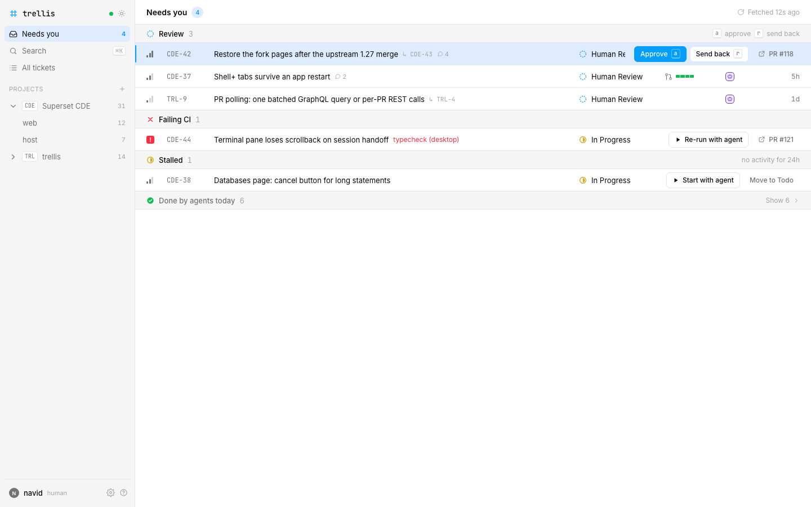

# trellis



## What it is

trellis is a local ticket tracker for work that humans give to agents.
It keeps each ticket, actor, pull request, and CI state on one machine.
It gives agents a CLI workflow and gives humans a focused review queue.

The project is under construction. The [approved plan](docs/design/plan.md) defines the v1 product.

## 30-second development install

```sh
git clone git@github.com:0x962/trellis.git
cd trellis
bun install
bun run dev
```

Open `http://localhost:5173` and create the first project.

After the install command ships, run `trellis install` once from the clone.
The command builds the web app and starts the local server after each login.

## Ticket workflow (trellis)

Tickets live in trellis, a local tracker at http://trellis.localhost. Use the `trellis` CLI. It prints JSON when piped.
Identify yourself: inside Claude Code every command runs as `agent:claude-code`. Elsewhere set `TRELLIS_ACTOR=agent:<name>`.

1. Pick work:        trellis list --project TRL --status todo
2. Read the ticket:  trellis show TRL-42 --comments
3. Start:            trellis move TRL-42 in-progress
4. Put the identifier in the branch name, for example TRL-42-dark-mode. A PR whose title, branch, or body carries TRL-42 links itself. To link one by hand: trellis pr add TRL-42 <url>
5. Split work:       trellis sub TRL-42 -t "Write tests"
6. Ask a question:   trellis comment TRL-42 --body "..." and then wait for the reply: trellis watch --ticket TRL-42
7. Finish coding:    trellis move TRL-42 agent-review
8. When CI is green and the self-review is done: trellis move TRL-42 human-review
Never move a ticket to Done; a human does that. Never delete tickets.

Without the CLI, the HTTP API takes the same actions. One call creates a ticket:
curl -X POST http://127.0.0.1:4521/api/tickets -H 'x-trellis-actor: agent:claude-code' -H 'Content-Type: application/json' -d '{"project":"TRL","title":"First"}'
The OpenAPI spec is at http://127.0.0.1:4521/api/openapi.json.

Copy this workflow from the CLI with `trellis instructions --project TRL`.
See the [agent setup guide](docs/agents.md) for a block that you can paste into another repository.

## CLI cheat sheet

Global flags: `--json`, `--jsonl`, `--quiet`, `--as`, `--url`, and `--no-color`.

| Command | Purpose |
|---|---|
| `trellis projects list` | List projects. |
| `trellis projects create` | Create a project. |
| `trellis projects show` | Show a project. |
| `trellis projects move` | Move a project. |
| `trellis projects repos` | Manage project repositories. |
| `trellis statuses list` | List statuses. |
| `trellis statuses add` | Add a status. |
| `trellis statuses edit` | Edit a status. |
| `trellis statuses rm` | Remove a status. |
| `trellis statuses clear` | Clear inherited statuses. |
| `trellis create` | Create a ticket. |
| `trellis show` | Show a ticket. |
| `trellis list` | List tickets. |
| `trellis edit` | Edit a ticket. |
| `trellis move` | Move a ticket to a status. |
| `trellis comment` | Add a comment. |
| `trellis comments` | List comments. |
| `trellis attach` | Add an attachment. |
| `trellis attachments` | List attachments. |
| `trellis pr add` | Link a pull request. |
| `trellis pr list` | List pull requests. |
| `trellis pr rm` | Unlink a pull request. |
| `trellis pr refresh` | Refresh pull request data. |
| `trellis pr diff` | Show a pull request diff. |
| `trellis sub` | Create a sub-ticket. |
| `trellis delete` | Delete a ticket. |
| `trellis search` | Search tickets. |
| `trellis activity` | List ticket or project activity. |
| `trellis brief` | Print an agent brief. |
| `trellis inbox` | Show work that needs a human. |
| `trellis watch` | Stream events. |
| `trellis open` | Print or open a ticket URL. |
| `trellis whoami` | Show actor resolution. |
| `trellis instructions` | Print the agent workflow. |
| `trellis status` | Show server status. |
| `trellis logs` | Show server logs. |
| `trellis serve` | Start the server. |
| `trellis install` | Install the local service. |
| `trellis uninstall` | Remove the local service. |
| `trellis backup` | Create a backup. |
| `trellis restore` | Restore a backup. |
| `trellis export` | Stream all data as JSON. |

## Architecture


The web app, mobile app, and CLI share the contract from `@trellis/api`.
Only the web app imports the tokens and primitives from `@trellis/ui`.
The local server owns all database access and sends live updates through server-sent events.

## Data and backups

trellis stores its database, attachments, backups, and logs under `~/.trellis`.
Set `TRELLIS_HOME` to use a different directory.

## Pair a phone

The server listens on `127.0.0.1`, so a phone cannot reach it.
Run `trellis install --host 0.0.0.0` to open it to your network (`trellis serve --host` and `TRELLIS_HOST` do the same).
The server has no auth, so anyone on the network can reach it.
Then open Settings in the web app and scan the code under Pair a phone with the trellis phone app.
Run `trellis backup [dest]` to create a consistent archive while the server stays available.
The server keeps the ten newest default backups.

## Contributing

Read [CONTRIBUTING.md](CONTRIBUTING.md) for the development loop, TDD rules, and review pass.

## License

MIT, see [LICENSE](LICENSE).
