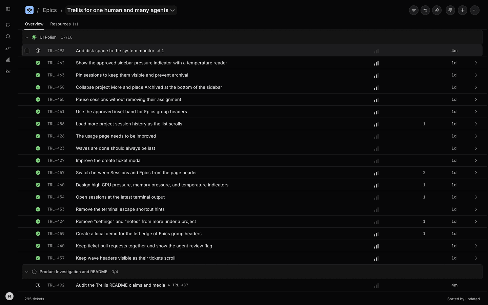
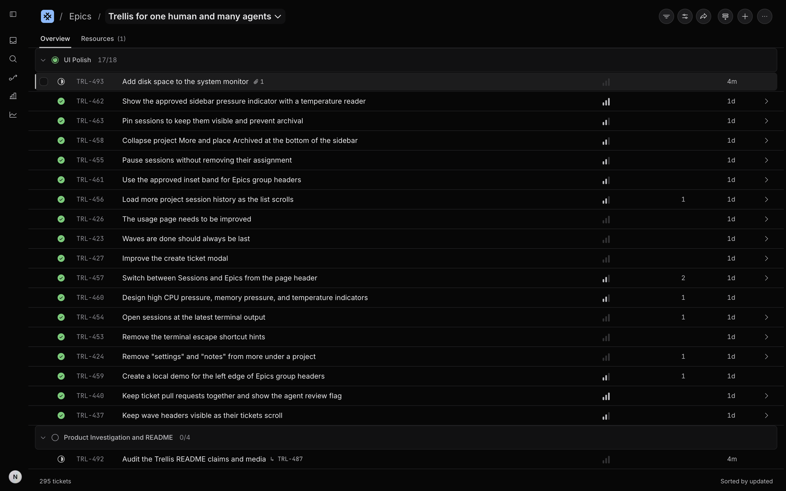
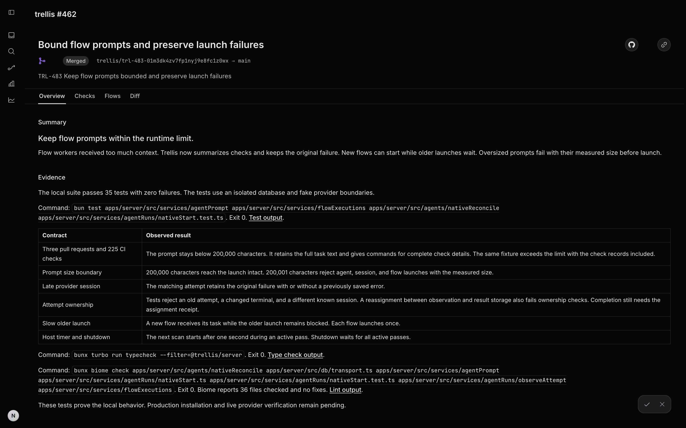

# Trellis

Trellis is a local workspace for people who direct coding agents. It connects the plan, each agent's work, GitHub pull requests, review evidence, and release decisions.



Trellis is a single-user app. One server on your Mac owns the data. The desktop app and CLI use that server.

## The workflow

1. Organize work into projects, epics, waves, tickets, and dependencies.
2. Assign a local coding agent to a ticket. Trellis keeps its assignment, Git worktree, and conversation when the process stops.
3. Link the pull request. Trellis keeps GitHub state, local review state, and review readiness separate.
4. Review the summary, test evidence, flow results, code, and local findings in one place.
5. Move the ticket through your own status list and keep the human release decision explicit.



The epic view keeps the plan and current work together.



The review view keeps the explanation, proof, findings, checks, and diff with the pull request.

## What Trellis connects

- Projects, repositories, custom statuses, epics, waves, ticket contracts, dependencies, and outcomes.
- Ticket agents, project sessions, standalone sessions, saved conversations, worktrees, and terminal output.
- GitHub pull requests, checks, summaries, test evidence, local review threads, and review flows.
- Claude, Codex, OpenCode, pi, Muse, and custom local agent commands.

Trellis runs agent processes under your local account. A worktree does not restrict operating-system access. Read [Security](SECURITY.md) before you add a repository or agent command.

## macOS local preview

The desktop source build supports macOS 13 or newer. It is a local preview, not a Developer ID-signed or notarized public release.

Install [Bun](https://bun.sh) 1.3 or newer, Git, Node.js, npm, Apple developer tools, and the [GitHub CLI](https://cli.github.com/). The build needs network access to download its dependencies. Run `gh auth login` if you want pull requests and checks. Install at least one supported agent CLI.

Run these commands from a clean, current `main` checkout. Keep at least 3 GB free for the build.

```sh
git clone https://github.com/0x962/trellis.git
cd trellis
bun install
bun run desktop:install
open "$HOME/Applications/Trellis.app"
```

The installer builds the app from source, signs the local preview, and installs it in `~/Applications`.

## Documentation

- [Desktop build and install](apps/desktop/README.md)
- [Agent runs and assignments](docs/agents.md)
- [Local pull request reviews](docs/reviews.md)
- [Architecture](docs/ARCHITECTURE.md)
- [Apache 2.0 license](LICENSE)
