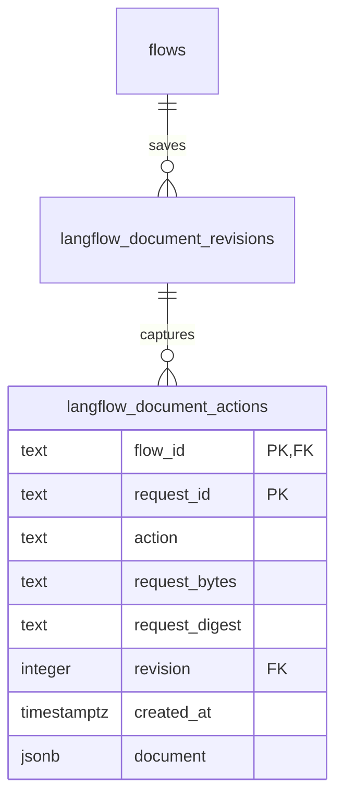

# Publication intents

`readDocumentAction(tx, {flowId, requestId})` returns the saved record or null. The record retains the action, request bytes, request digest, captured revision, creation time, and nullable completed document.

`claimDocumentAction(tx, {flowId, requestId, action, requestBytes, revision, createdAt})` returns `{state, record}`. The state is `claimed`, `replayed`, or `request_conflict`. A replay retains the first creation time. A changed action, revision, or exact request string conflicts. The caller holds the flow lock and checks the current revision before the first claim.

`completeDocumentAction(tx, {flowId, requestId, document})` returns the original completed `FlowDocumentV1`. It locks the action row and permits one final receipt. A changed final receipt fails. Publication can complete its captured immutable revision after a newer flow edit. Conversion uses its existing save receipt; the action value remains available for a future caller with its own revision check.

Migration 0142 adds the table and a trigger that preserves the request identity and completed receipt. A composite foreign key retains the captured revision and follows flow deletion. Three migrated fixtures cover pending replay, reopen, historical publication, conflicts, rollback, and deletion. Their execution is deferred until the complete source batch.

