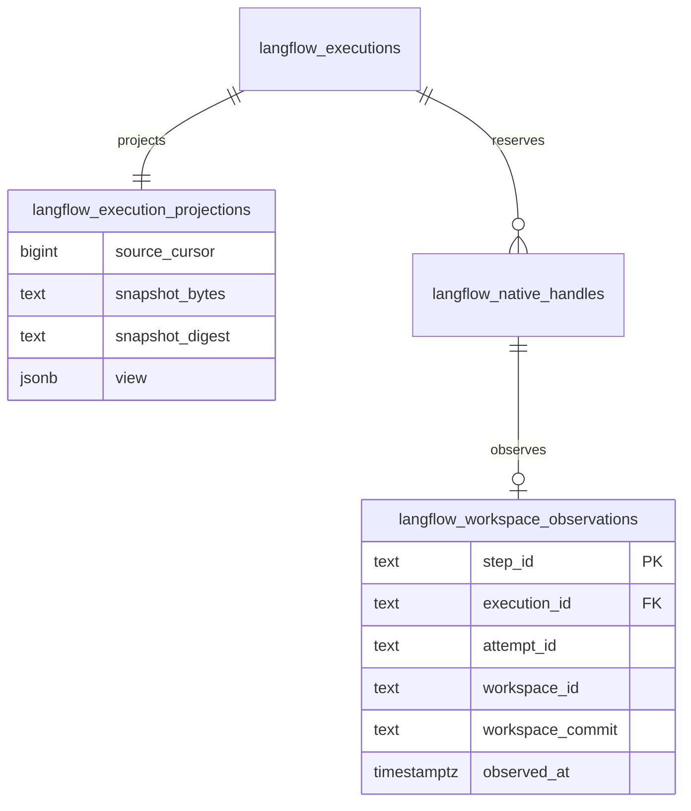

# Engine observations

`commitProjection` accepts `engineSnapshot: {sourceCursor, snapshotBytes}`. The query locks the execution and checks the expected projection revision. It binds the snapshot and its checkpoint to the saved execution, publication, job, and current epoch. It stores the exact snapshot string, its SHA256 digest, its engine cursor, and the projected view in one transaction.

`readEngineSnapshot` returns `{sourceCursor, snapshotBytes, snapshotDigest}` or null. Engine cursors can advance across a gap without a corresponding Trellis event. Equal cursor values require equal original bytes. Older cursor values fail.

`writeWorkspaceObservation` receives the exact execution, step, attempt, and workspace, plus `workspaceCommit` and `observedAt`. The tuple must match a saved native reservation. A newer null observation preserves a known commit. Every newer observation advances the saved time. An older time or a changed hash at the same time fails. `readWorkspaceObservation` reads the tuple. `readProjectionFacts` includes all saved workspace observations.

Migration 0141 adds these fields and the workspace table. Historical projections start at cursor zero with unknown snapshot bytes. Six migrated fixtures cover replay, rollback, reopen, cursor gaps, observation order, and exact native identity. Their execution is deferred until the complete source batch.
