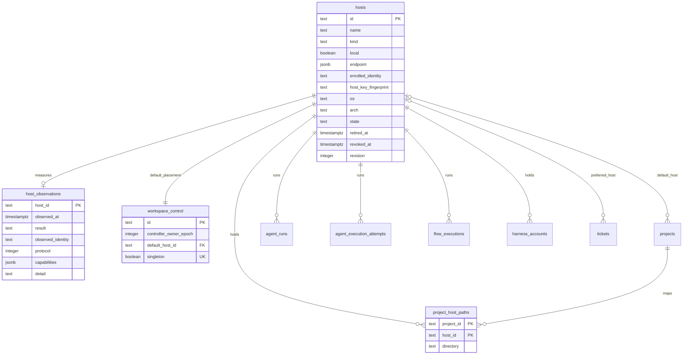

# Host tables

A host is a machine that runs agents. These tables store the hosts of a workspace, the health of each host, the one control row of the workspace, and the repository directory of each project on each host. Migration `0152_hosts` creates them.

## Identity

The `id` of a host is a ULID and the durable identity. The name is a label. A rename and an endpoint edit change the row and never the id. `enrolled_identity` holds the identity the worker reports at enrollment. An edit of the name or the endpoint leaves it as it is.

Every row that names a host holds its id with a foreign key. The foreign keys on `agent_runs`, `agent_execution_attempts`, `flow_executions`, `harness_accounts`, `project_host_paths`, `projects`, `tickets`, and `workspace_control` are NO ACTION. The delete of a host that any of them names fails. `host_observations` is the one exception: an observation is a measurement, so the delete of a host removes it.

A retired or revoked host keeps its row. `listHosts` hides it unless the caller asks for `includeRetired`, and `getHost` returns it in every state. A historical run keeps the host it ran on.

## The local host

Exactly one row has `local = true`. The partial unique index `hosts_local_idx` refuses a second one, and the check `hosts_local_check` ties `local` to `kind = 'local'`. Migration `0152_hosts` inserts the row with the name `Execution host`, because a migration cannot read the machine name. TRL-1618 renames it to the machine name on the first start through the revision edit. The identity is the id, not the name.

The migration also creates the SQL function `local_host_id()`. It returns the id of the local host. The `host_id` columns on `agent_runs`, `agent_execution_attempts`, `flow_executions`, and `harness_accounts` use it as the default. A service that writes one of these rows and names no host therefore binds the row to the local host. The migration binds every existing row the same way.

## Endpoint

`endpoint` is a connection reference. For an ssh host it holds `alias`, `user`, `port`, and `credentialRef`. `credentialRef` is an opaque name of a secret that lives outside the database. The database never holds a key, a password, or a passphrase.

## Control

`workspace_control` has one row. `singleton` is always true and unique, and the check `workspace_control_singleton_check` refuses false, so a second row cannot exist. `controller_owner_epoch` starts at 1. `advanceControllerOwnerEpoch` raises it with one UPDATE that names the expected epoch, so one of two racing controllers wins. `default_host_id` is the placement of a run whose ticket and project name no host.

## Project paths

`project_host_paths` holds the repository directory of a project on one host. The migration inserts one row per project with a nonempty `projects.directory`, bound to the local host. `projects.directory` stays as it is. TRL-1627 and TRL-1653 move its consumers to this table.

## Queries

`apps/server/src/db/queries/hosts/` holds the queries. Every function takes `(tx, input)`. `editHost` and `setHostState` write with one UPDATE that names the revision the caller read. The revision grows by one on success, and a stale revision changes no row and returns null.
