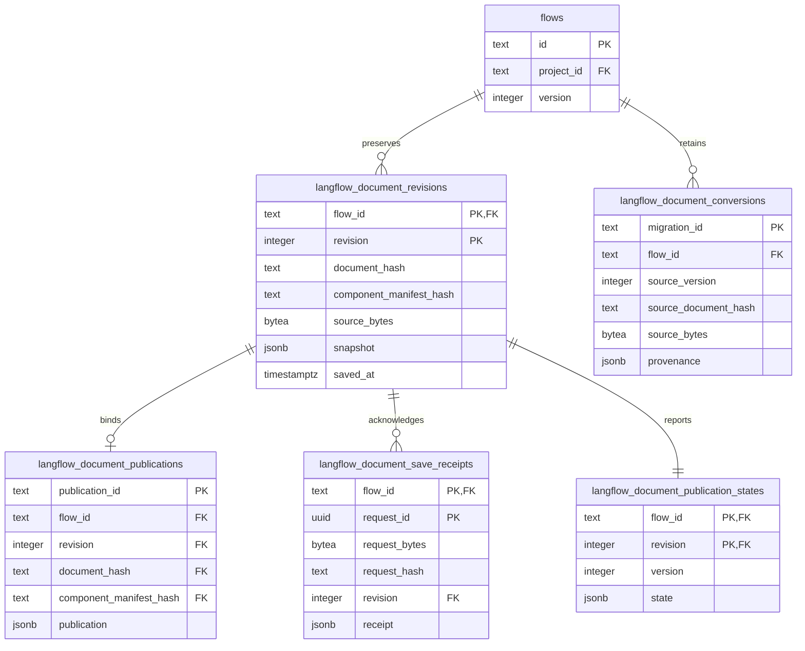

# Immutable flow documents

`flows` remains the catalog. Its ID, project scope, and version retain their existing meaning.
`saveDocument(tx, input)` locks that catalog row and checks the request receipt before it compares the version.
Equal request bytes return the original `FlowDocumentV1` response, including its original publication state.
Changed bytes return `request_conflict`. A different request with an old version returns `version_conflict` and writes nothing.
The caller maps these results to the existing public errors.

The caller validates request input before this query. It resolves the flow ID and supplies validated content with its matching source bytes.
`requestBytes` contain the complete submitted request bytes, including the expected version and document content.
`sourceBytes` contain the exact document source bytes. Each digest is lowercase SHA256 of the corresponding buffer.
The queries do not normalize bytes. PostgreSQL checks each stored digest against its bytea column.
For a JSONB historical source, retain its available serialization before any schema defaults or normalization.
JSONB does not retain the original submitted whitespace. A later export cannot recover those unavailable bytes.

`insertDocumentRevision` retains a historical snapshot at its recorded metadata version without a catalog update.
A save increments `flows.version` once and inserts the snapshot and receipt in the same caller transaction.
The transaction also preserves the current metadata and catalog scope in the snapshot.
Publication binds one revision, document hash, and component manifest to one engine receipt.
A later save retains the preceding publication as historical information. That reference does not authorize a new run.

Conversion provenance uses a private database type. The public API exports no `SavedDocument` or `MigrationRecordV1` type.
A conversion record retains its source export reference, source bytes, source version, maps, instruction hashes, diagnostics, and converter identity.
A blocked conversion can have no target hash. It does not create a target revision or a historical revision that never existed.
Each conversion record describes one immutable result. Later conversion results require distinct migration IDs.

## ER diagram



## Publication progress and service reads

`readLatestDocumentRevision(tx, {flowId})` returns the newest stored revision or undefined.
`readLastDocumentPublication(tx, {flowId})` returns the latest immutable publication or undefined.
`readDocumentSaveReceipt(tx, {flowId, requestId})` returns the original bytes and response before a caller changes legacy rows.

Each imported or saved revision starts with a publication-state row at version 1.
`readDocumentPublicationState(tx, {flowId, revision})` returns `{version, state}` and gives an immutable publication precedence over progress.
`writeDocumentPublicationState` takes the exact flow, revision, expected state version, and unpublished state.
It returns `updated` with the new state version, `conflict` with the current state version, or `published` with the immutable receipt.
Both publication insertion and progress updates lock the same document revision.
A late failure cannot replace a published result. A late result for one revision cannot change another revision's state.
The mutable table retains pending, blocked, and failed results across a restart. The original save receipt remains immutable.

## Schema and migration handoff

Principal reserves document migration 0133 after the stable observer migration 0132.
TRL-683 owns schema adoption and generation of document migration 0133, then receipt migration 0134.
Principal supplies the exact stable predecessor. The owner preserves the existing 0131 hash-exclusion SQL and snapshots.
This source checkpoint does not change `schema.ts`, the migration files, or the journal.

The proposed `schema.ts` export is:

```ts
export {
    langflowDocumentConversions,
    langflowDocumentPublications,
    langflowDocumentPublicationStates,
    langflowDocumentRevisions,
    langflowDocumentSaveReceipts,
} from "./tables/langflowDocuments/index.ts";
```

`langflowDocumentPublications.publicationId` uses PostgreSQL text and the public ULID identity.
Its SQL name is `langflow_document_publications.publication_id`.
The unique `(flow_id, revision)` pair forbids a replacement engine mapping for the same saved document.
The composite foreign key checks the document hash and component manifest as well as the flow ID and revision.
TRL-683 can reference this publication ID from its execution receipt tables.

The migration must install `immutableDocumentRowsSql` from `immutableRows.ts` after it creates the immutable tables.
Those triggers reject updates. Flow deletion still cascades through these tables under the existing catalog deletion policy.
The migration owner must also preserve all declared checks, unique constraints, and foreign keys.
The fixture creates the declared tables in memory and uses the same trigger source.
It does not prove migration generation, upgrade, restore, or installed-host behavior.

TRL-684 owns the service composition, public error mapping, engine publication, and metadata revision integration.
TRL-675 retains the real migration, legacy preservation, restore, and engine acceptance requirements.
No service registry imports these queries in this checkpoint.

## Verification handoff

Run the four test files under `apps/server/src/db/queries/langflowDocuments/` in the combined verification environment.
They cover request uniqueness, exact retry output, metadata conflicts, caller rollback, immutable publication identity, catalog scope, deletion, and legacy bytes.
Run the server type check and Biome on both owned folders after the merged batch.
These checks remain unexecuted at source publication, as the ticket requires.
