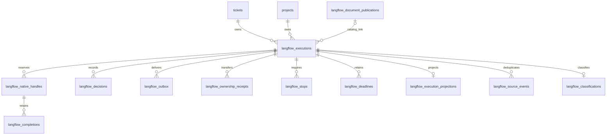

# Execution receipts

All queries receive the caller transaction. The caller authenticates the actor and validates each external protocol payload before the query.
The caller creates the native agent run and attempt in that transaction before `reserveNative` returns.
Network calls run after commit. The stored capability ID does not authenticate its caller.

`langflow_executions` stores the immutable publication ID, publication, and document snapshot.
The nullable `publication_record_id` links the catalog row. Flow deletion clears that link and retains execution history.
Ticket and project deletion cascade through execution receipts. Diff deletion clears `diff_id`.
Native records retain original agent and attempt IDs as immutable provenance, even if their catalog records later disappear.

`reserveExecution(tx, row)` inserts one actor/request identity or returns its saved row for equal original request bytes.
The input uses `typeof langflowExecutions.$inferInsert`. New submissions use closed admission and null correlation, job, session, and authority.
`readExecution(tx, {executionId})` returns the stored row or null.
`lockExecution(tx, {executionId})` returns the row with a transaction lock or throws.
`openAdmission(tx, {executionId, correlation, receipt, authority})` commits the job association, admission receipt, and outbox together.
The service confirms current ownership before it calls this query.

`reserveNative(tx, {requestBytes, taskKey, handle, authority, now})` preserves the exact task key and original request bytes.
The semantic key includes the node, parent occurrence, phase, and every loop and round.
Equal replay returns the original handle. Changed bytes conflict.
`updateNativeHandle(tx, {executionId, expectedRevision, handle})` permits late workspace and provider session observations.
Once present, those identities cannot change. `recordLaunch(tx, {executionId, receipt})` preserves the original launch receipt.
`recordCompletion(tx, {resultBytes, completion})` writes the accepted result and outbox in one transaction.
The trusted observer must confirm the prompt and final result before this query.
`confirmCompletion(tx, {receipt})` retains exact engine acceptance.

`recordDecision(tx, {payloadBytes})` writes the decision and outbox together.
The service verifies the human actor, pending occurrence, action key, and expected projection revision under the execution lock.
`updateDecisionDelivery(tx, input)` records pending, unknown, or confirmed delivery.
Confirmation requires the exact decision, job, request, and payload digest.

`transferOwnership(tx, {requestBytes, receipt})` compares owner, epoch, and revision and preserves the original launch provenance.
The supervisor must first prove that the old owner cannot dispatch.
The receipt retains its observation and revocation references.
`cancelExecution(tx, {intent, obligations})` requires the current execution revision and a stop for every reserved attempt.
`recordStop(tx, {obligation})` and `updateStop(tx, {expectedRevision, obligation})` preserve exact attempt identity.
`recordDeadline(tx, {executionId, deadline})` preserves the first observed launch deadline.
The caller records the launch receipt and group deadlines in one transaction.

`classificationStore` exports claim, finish, read, and interrupt from `classification.ts`.
Claim takes `{binding, ownerToken, requestBytes}` and returns `{receipt, acquired}`.
Finish takes `{receiptId, ownerToken, result}`. Read takes `{executionId}`.
Interrupt takes `{executionId, ownerToken, error}` after the supervisor confirms takeover.
A finished receipt is permanent. A late provider result returns the stored failure after interruption.

Projection exports: `initializeProjection`, `readProjection`, `findEvent`, `commitProjection`, `listEvents`, and `retainEvents`.
`commitProjection` takes `{executionId, expectedRevision, view, event, sourceBytes}`.
An event requires original source bytes. A snapshot-only update supplies null for both event and sourceBytes.
The service checks authority under `lockExecution` before the projection write.
The query commits the event identity, sequence, and projection together.
`findEvent` retains every original event and sequence after the visible replay cursor advances.
No physical event purge occurs. A replay before `firstAvailableSeq` requires an explicit gap response from the service.

`readProjectionFacts(tx, {executionId})` returns native reservations, human deliveries, stops, and deadlines.
Each native row includes provenance, handle, launchReceipt, and optional completion with resultDigest and receipt.
The result digest covers the original result bytes. It does not hash a JSONB serialization.
`listPendingDeliveries(tx, {executionId, afterId, afterKind, limit})` retains access to every outbox item through keyset pages.
It returns current authority and cancellation state separately from immutable payload bytes.

## ER diagram

`cancelExecution` also writes the engine cancellation outbox in the intent transaction.
After cancellation, `listPendingDeliveries` returns only cancellation notices. Other payloads remain stored for audit.
`reserveWarning(tx, input)` stores one original message per execution, attempt, deadline, and half or quarter threshold.
Input fields are messageId, executionId, attemptId, deadlineId, threshold, and payloadBytes.
`confirmWarning` requires executionId, messageId, attemptId, receiptId, and acknowledgedAt.
`listPendingWarnings` takes executionId, afterId, and limit. Cancellation blocks new warnings and warning delivery.

`readStartRequest` reads actorKind, actorName, and requestId. `saveStartRequest` adds original requestBytes and executionId.
This permanent alias permits another request UUID to reuse an existing execution without losing its replay identity.
`latestExecution(tx, {flowId, diffId})` returns the newest execution and optional projection.
The start service retains the legacy selection policy and serializes flow selection in its caller transaction.
`bindExecution(tx, {executionId, correlation, authority})` saves the exact job while admission stays closed.
`markSubmissionUnknown` preserves a concurrent committed job binding.
`commitProjection` accepts an optional original EngineCheckpointV1 as checkpoint and writes it with the view.
`readCheckpoint` reads that exact stored checkpoint. A smaller revision or changed equal revision conflicts.
`readDecision(tx, {executionId, decisionId})` returns original payloadBytes and the stored delivery state.

Graph keys and source event IDs retain their full text. SHA256 columns provide fixed-size keys for their unique constraints.
Database checks bind each digest to its original text. Receipt queries compare the original bytes before they accept a replay.
`saveStartRequest` permits both Langflow and legacy execution aliases. Separate nullable foreign keys preserve their respective deletion cascades.
`confirmAdmission(tx, {executionId, receipt})` closes the outbox item only for the exact retained admission receipt.
