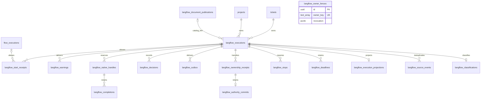

# Retained execution tables

These declarations preserve tables from applied migrations.
Existing databases retain their records and constraints.
Migration 0139 also uses these tables for actor identity constraints.
Keep the declarations aligned with the migration snapshots to prevent accidental table deletion.
The native flow services use the original flow tables.

