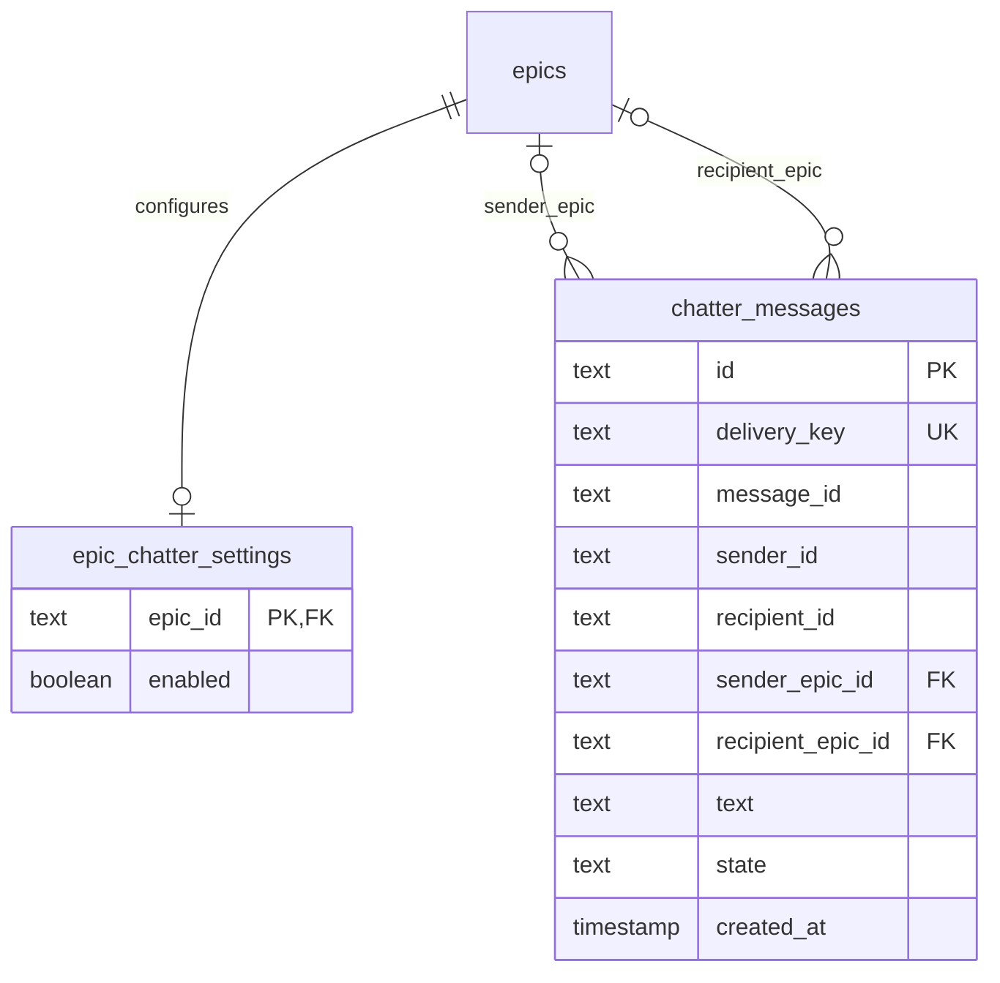

# Chatter

The epic toolbar opens Chatter in a sheet. The sheet lists agent messages in time order and contains the Chatter switch.
Chatter is on by default. A person can turn it off. An agent cannot change the setting.
An archived project permits reads and refuses setting changes.

An agent message checks the current epic of both its sender and its recipient.
If either epic has Chatter off, the send fails before runtime inspection, interruption, input, or idle resume.
Human messages and system notices use their existing delivery paths.
The switch affects new sends. A send that already passes the check can finish.

`agentRuns.send` and `agentRuns.terminalInput` use the same policy and record writer.
The record contains the complete text, sender and recipient names, their epic memberships at send time, and a delivery state.
Human messages and system notices do not enter this log.
A message between epics appears in both epic logs. A message to or from a standalone session appears in the epic log.
Names and memberships remain attached to the record when a ticket moves or an agent record changes.
The log starts when this feature is installed.

The writer commits `pending` before runtime delivery and commits the result after delivery returns.
`sent` means the send service accepts delivery. `queued` means it accepts delivery at a turn boundary.
`skipped` means the idle condition prevents delivery. `unconfirmed` means the send raises an error.
A host exit between these transactions leaves `pending`. A log entry never proves that an agent reads a message.
The delivery identifier deduplicates the record. Its digest has a fixed length; the original identifier and text remain intact.
Database transactions contain no runtime calls.

The API exposes `epicChatter.get`, `epicChatter.set`, and `epicChatter.list`.
The list returns the newest 50 records and a cursor for older records. Pagination has no total limit.
The `epic-chatter.changed` event invalidates Chatter queries after a committed write.
The UI keeps the latest message visible while the reader stays at the bottom. It preserves the reading position when older messages load.

Migration 0147 follows 0146 and adds two tables. An epic without a settings row uses the default enabled state.
Deleting an epic removes its setting and clears that epic's reference in retained messages.

