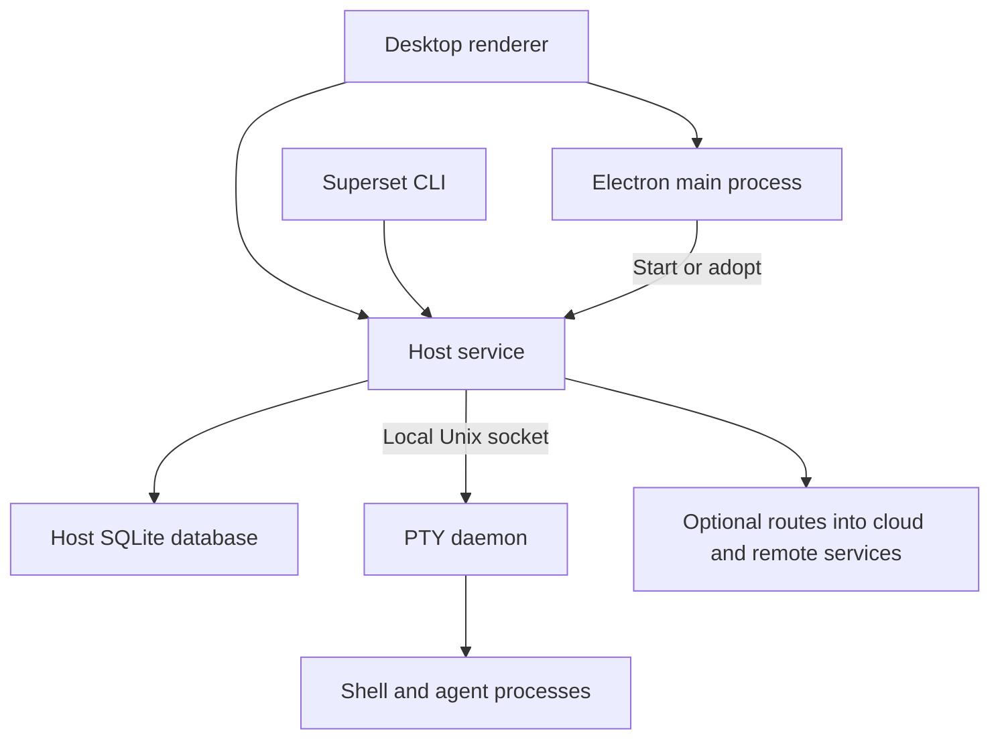
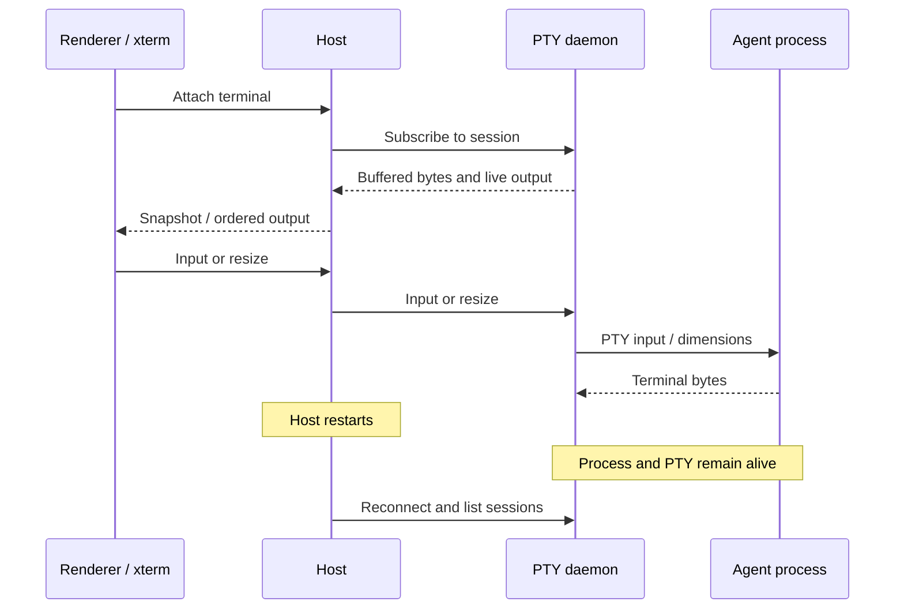

# Superset desktop architecture

Superset separates the desktop interface, host service, and terminal processes. This separation lets terminals survive a host restart. It also lets the CLI and desktop use the same host API. Trellis can adopt this structure without a required Superset service.

The terminal structure alone does not solve unattended ticket work. Trellis needs a durable controller for assignments, manager triggers, completion evidence, and recovery. Those responsibilities sit above terminal execution.

This report describes verified source behavior. The [Trellis desktop plan](trellis-desktop-plan.md) contains the proposed design and release gates.

## Evidence scope

The source snapshot is Superset commit `1019540c0be5069eb5ff3ebb22e5707a42e0999d`. Its desktop package declares version `1.27.0`. The installed desktop and CLI declare `1.25.1`. Source behavior and installed behavior therefore represent different versions. The source checkout had no local changes.[^1]

The installed desktop exposes New Workspace, Workspaces, Automations, Tasks, Pull requests, Pages, and project navigation. Its workspace board shows Idle, Working, Needs attention, and Needs review. The source also defines Merged and Deleted columns.[^2]

The live Trellis audit used Superset to complete one small local ticket after a manual manager wake. It did not prove automatic triggers or recovery. The [audit record](/tmp/trellis-readiness-20260914/readiness-report.md) is machine-local; the portable findings appear below.

## 1. Process ownership

The Electron main process manages windows and coordinates host services. The coordinator maintains one entry per organization. Concurrent starts share a pending promise. A filesystem lock serializes starts across app instances. After it acquires the lock, the coordinator checks again for a host to adopt.[^3]

A manifest identifies a host endpoint, process, authentication token, organization, and start time. The CLI reads that manifest for a direct local connection. A separate path resolves remote hosts through a relay. The CLI sends API requests directly to the host.[^4]

The coordinator distinguishes owned hosts from adopted hosts. It stops owned children when its stop path runs. It does not terminate an adopted host that another instance owns. Its restart logic has a crash budget and cancellation checks.[^3]

These mechanisms address distinct races. A pending promise covers concurrent calls inside one process. A filesystem lock covers different processes. A manifest supports discovery. A health check determines whether the endpoint responds. None of these mechanisms alone proves ownership or successful work.

**Implication for Trellis:** both the desktop and CLI must discover one host for one data home. A window must never start an independent manager scheduler. Process identity needs more than a PID, because operating systems reuse PIDs.

## 2. How terminals run

The current PTY package owns pseudo-terminal descriptors in a separate Node process. It uses `node-pty` to start shells. The host connects through a versioned protocol over a Unix socket. The package imports no other Superset workspace package.[^5]

The renderer uses xterm. The host carries terminal bytes over WebSockets and maintains terminal state for snapshots. The host contains sequence-aware reconnect logic. The daemon keeps a separate bounded byte buffer. These buffers serve different parts of the reconnect path.[^6]

The daemon buffer defaults to 64 KiB per session. It lives in memory. It survives a host restart because the daemon survives. It does not survive daemon death and does not constitute a durable transcript.[^5]

The daemon checks protocol compatibility at connection time. Its socket has owner-only permissions. It handles subscriber backpressure so a slow consumer does not require unbounded memory. Its process teardown tracks terminal and process-tree identity.[^5]

Superset also implements descriptor handoff to a successor daemon. This lets compatible daemon upgrades preserve terminal sessions. The package includes tests for handoff, interrupted handoff, descriptor leaks, byte fidelity, and process cleanup.[^5]

Superset runs this package under Node, including in integration tests. Its README records incompatibility between the tested `node-pty` 1.2 implementation and Bun 1.3 descriptor behavior. That result applies to those tested versions. It does not establish that every future Bun release fails.[^5]

**Implication for Trellis:** use a separate Node execution service for native PTYs. Keep database work and ticket logic outside that service. Treat descriptor handoff as a later feature. A first release can defer a daemon update until its sessions finish.

## 3. Agent identity and lifecycle

Superset records a binding between a terminal, workspace, agent definition, and agent conversation. The binding includes start time, last event, end time, and end reason. The host persists these bindings in its database.[^7]

The normalized lifecycle includes `Attached`, `Detached`, `Start`, `Stop`, `PermissionRequest`, and `Failed`. Attach and detach describe the agent session. Start and stop describe a turn. A stopped turn can leave a live terminal and a resumable conversation.[^8]

The host provisions agent hooks, PATH wrappers, and shell bootstrap files. Missing hook templates produce a diagnostic. This setup matters on standalone hosts as well as desktop hosts. A shell that starts successfully does not prove that its hooks work.[^9]

The mapping is not a universal semantic guarantee. For example, the inspected mapper includes `PreToolUse` among permission-related events. Trellis must verify each harness event before it presents that event as a confirmed permission block.[^8]

The host exposes agent-aware operations as well as raw terminal operations. `getOrCreate` reuses a matching active binding and coalesces concurrent calls. The source explicitly distinguishes a returned binding from a prompt-ready agent.[^10]

Resume uses a persisted candidate claim and a concurrent-call map. The host tracks the successor terminal after a successful resume. It checks conversation availability for some candidates. An unreadable conversation is different from a conversation known to be absent.[^10]

These mechanisms reduce duplicate sessions. They do not prove exactly-once execution across every crash point. The inspected event bus broadcasts events to current consumers. It does not establish a durable, acknowledged queue for business work.[^8]

**Implication for Trellis:** preserve the difference between a conversation, an execution attempt, a terminal, and a turn. Store assignments separately. Use stable identifiers and durable claims. Treat event delivery and task completion as separate protocols.

## 4. Workspaces and local state

The host combines a local database, workspace filesystem management, Git observation, credential providers, and agent execution. The filesystem watcher supplies shared Git observations. Expensive repository reads can run through a worker pool.[^11]

The desktop stores layouts as tabs and split trees. Each tab identifies its active pane. The persistence schema includes a version and validates stored layouts before use.[^12]

The desktop rules document a renderer freeze after localStorage reached 23.7 MB. Those rules limit localStorage to small, bounded state. Per-entity state belongs in host storage. This is a recorded repository incident, not a universal browser quota.[^13]

Superset includes a narrow trust bootstrap for empty session folders that the host creates. The source explicitly excludes folders with pre-existing content. It updates the selected agent account's trust store, not an arbitrary default path.[^9]

The full host also accepts an organization identifier, cloud API URL, authentication provider, and credential provider. It is not a standalone offline ticket runtime. A direct host adapter removes CLI transport overhead but retains Superset as an execution dependency.[^11]

**Implication for Trellis:** preserve drafts, layout state, conversations, and workspaces independently. A closed pane must not delete a conversation. A stopped agent must not delete a worktree. Repository trust must appear as an explicit capability during setup.

## 5. Desktop experience

Superset starts new work from a prompt with agent, model, device, project, and branch choices. Its workspace board combines agent state and PR state. A failed agent or permission state takes precedence over normal activity. An open PR can place a workspace in Needs review.[^2]

The source supports workspace layouts, terminal panes, file content, and changes. Shared navigation lets a person move among active workspaces. A notification controller groups event subscriptions by host and connects lifecycle events to desktop notifications.[^12]

The installed board provides useful evidence for the state model. It does not establish that every badge accurately represents the underlying agent. The earlier Trellis audit found live terminals whose turns had stopped. That distinction remains important even when a desktop has better visibility.

**Implication for Trellis:** adopt the attention queue and integrated work area. Keep tickets as the primary object. Present completion evidence before terminal activity. Put manager operation in the project workspace, with configuration in settings.

Trellis already has full-page tickets, a properties rail, local PR reviews, agent details, and flow drafts. Its current agent details refresh observed state only while the page is visible. The controller must take that responsibility before the desktop becomes a reliable unattended client.[^14]

## 6. Packaging and updates

Superset uses Electron, a bundled renderer, and separate host resources. Its build configuration includes native module copies, migrations, CLI resources, platform packages, macOS signing settings, and update manifests. The source pins Electron `41.10.3`; this is a snapshot fact, not a Trellis version recommendation.[^1][^15]

Electron native modules need a build compatible with the runtime that loads them. Electron's official documentation describes this ABI requirement. A successful development launch does not prove that the installed package contains the correct binaries.[^16]

The desktop also supports an application URL scheme. Its main window uses a preload script and a persistent Electron session. Trellis should define its own narrow preload API and isolate its renderer. It does not need Superset's embedded browser surface for the first release.[^15][^17]

**Implication for Trellis:** test the signed, installed app early. Validate native binaries, database assets, hooks, and CLI discovery on a machine without development tools. Make update compatibility a protocol rule.

## 7. What Trellis should reuse conceptually

| Superset mechanism | Trellis decision | Reason |
| --- | --- | --- |
| Desktop and CLI share a host | Adopt | One owner for state and commands |
| Separate PTY process | Adopt | Host restart must preserve active execution |
| Versioned terminal protocol | Adopt | Safe reconnect and upgrade decisions |
| Persisted agent binding | Adapt | Trellis also needs assignments and attempts |
| Hooks plus process observation | Adapt | A process is not a completed turn |
| Worktree per task | Adapt | Isolate writable assignments; preserve project policy |
| Attention board and notifications | Adopt | Expose a specific next action |
| Flexible pane tree | Simplify | Start with a ticket and one work area |
| Per-organization host routing | Omit from first release | One local data home needs one host |
| Cloud identity and relay | Optional future adapter | Local work must not depend on a Superset account |
| Descriptor handoff | Defer | Host-restart survival addresses the first release |
| Superset package transplant | Do not assume | The root license declares ELv2, not MIT |

The license observation is a source fact. A code-copy decision requires a separate dependency and license review. An independent implementation can use the architecture as a reference.[^18]

## 8. What the Trellis audit establishes

RDT-1 used the existing manager and builder personas. The manager became idle before ticket creation. No automatic wake occurred within the observed 42-second interval. One manual wake started one builder. The builder produced a slug function and four passing tests. The manager checked the output and moved the ticket to Human Review.[^19]

The manager created its own temporary shell poll to observe completion. This shows that an agent can compensate for a missing controller. It does not establish a supported completion trigger.

The inspected Trellis dispatcher excludes projects with a selected manager persona. Its actor filter also depends on legacy builder and reviewer name prefixes. New run identities use a different form. Trellis therefore needs one control path with identity-based routing.[^20]

The audit also found a manager row that retained `running` after refresh reported a missing Superset workspace. Current refresh code updates the error without necessarily changing that state.[^20]

No active duplicate manager appeared in the scratch test. A second manager start failed with `DUPLICATE`. Multiple workers on one ticket remain intentional supported behavior. The new design must prevent repeated assignments without prohibiting deliberate parallel work.[^19]

## 9. Session launch inspection, September 17, 2026

The session inspection uses the same pinned source snapshot. Superset separates the workspace, provider conversation, and terminal process attempt.
Its standalone session creates an empty Git repository. Its project workspace path creates a linked worktree from the selected base.
Both paths pass agent launches through `dispatchSugarAgents`. The shared input accepts agent type, model, effort, prompt, and attachment IDs.[^21]
The agent router validates the model and effort, resolves attachment paths, and uses the common native launch function.[^22]
The chat runtime also keeps a command journal and session registry. A command ID can identify a repeated request.[^23]

Trellis project sessions use `reserve`, `startNative`, and `nativeWorkspace`, which also serve ticket agents.
The saved session settings include the selected harness, model, and effort. Each project session has a separate Git worktree.
Create requests bind their IDs to the prompt, launch settings, and file content hashes. Resume keeps the workspace and confirmed provider conversation.
The session composer sends files through the shared delivery service. The project session list reads agent runs, so ticket agents appear without duplicate session records.

## Sources

All source links below pin the inspected snapshot. Sections 1 through 8 use source access and installed observations from September 14, 2026. Section 9 uses source access from September 17, 2026. Official documentation describes platform behavior at access time.

[^1]: Superset, [desktop package](https://github.com/superset-sh/superset/blob/1019540c0be5069eb5ff3ebb22e5707a42e0999d/apps/desktop/package.json). Installed version: `CFBundleShortVersionString` and `CFBundleVersion` in `/Users/navidkhan/superset-official-backup-20260902/Superset.app/Contents/Info.plist`, both `1.25.1`.
[^2]: Superset, [board state derivation](https://github.com/superset-sh/superset/blob/1019540c0be5069eb5ff3ebb22e5707a42e0999d/apps/desktop/src/renderer/routes/_authenticated/_dashboard/v2-workspaces/utils/deriveBoardColumn/deriveBoardColumn.ts#L10). Installed UI observations: `#/new-workspace` and `#/v2-workspaces`, including the visible column labels and prompt controls.
[^3]: Superset, [host coordinator](https://github.com/superset-sh/superset/blob/1019540c0be5069eb5ff3ebb22e5707a42e0999d/apps/desktop/src/main/lib/host-service-coordinator.ts#L284), especially `startWithPreferredPorts`, `startOrAdopt`, `tryAdopt`, `stop`, and `scheduleRespawn`.
[^4]: Superset, [host target resolution](https://github.com/superset-sh/superset/blob/1019540c0be5069eb5ff3ebb22e5707a42e0999d/packages/cli/src/lib/host-target/resolveHostTarget.ts) and [manifest](https://github.com/superset-sh/superset/blob/1019540c0be5069eb5ff3ebb22e5707a42e0999d/packages/cli/src/lib/host/manifest.ts).
[^5]: Superset, [PTY daemon README](https://github.com/superset-sh/superset/blob/1019540c0be5069eb5ff3ebb22e5707a42e0999d/packages/pty-daemon/README.md), [session buffer](https://github.com/superset-sh/superset/blob/1019540c0be5069eb5ff3ebb22e5707a42e0999d/packages/pty-daemon/src/SessionStore/SessionStore.ts#L4), and [daemon server](https://github.com/superset-sh/superset/blob/1019540c0be5069eb5ff3ebb22e5707a42e0999d/packages/pty-daemon/src/Server/Server.ts).
[^6]: Superset, [host terminal transport](https://github.com/superset-sh/superset/blob/1019540c0be5069eb5ff3ebb22e5707a42e0999d/packages/host-service/src/terminal/terminal.ts#L244) and [shared daemon client](https://github.com/superset-sh/superset/blob/1019540c0be5069eb5ff3ebb22e5707a42e0999d/packages/host-service/src/terminal/daemon-client-singleton.ts).
[^7]: Superset, [agent binding types](https://github.com/superset-sh/superset/blob/1019540c0be5069eb5ff3ebb22e5707a42e0999d/packages/host-service/src/terminal-agents/types.ts) and [persistence](https://github.com/superset-sh/superset/blob/1019540c0be5069eb5ff3ebb22e5707a42e0999d/packages/host-service/src/terminal-agents/persistence.ts).
[^8]: Superset, [event mapping](https://github.com/superset-sh/superset/blob/1019540c0be5069eb5ff3ebb22e5707a42e0999d/packages/host-service/src/events/map-event-type.ts), [event types](https://github.com/superset-sh/superset/blob/1019540c0be5069eb5ff3ebb22e5707a42e0999d/packages/host-service/src/events/types.ts), and [event bus](https://github.com/superset-sh/superset/blob/1019540c0be5069eb5ff3ebb22e5707a42e0999d/packages/host-service/src/events/event-bus.ts).
[^9]: Superset, [agent setup](https://github.com/superset-sh/superset/blob/1019540c0be5069eb5ff3ebb22e5707a42e0999d/packages/host-service/src/runtime/agent-provisioning.ts#L29) and [trust bootstrap](https://github.com/superset-sh/superset/blob/1019540c0be5069eb5ff3ebb22e5707a42e0999d/packages/host-service/src/trpc/router/workspace-creation/shared/seed-agent-trust.ts#L1).
[^10]: Superset, [terminal agent router](https://github.com/superset-sh/superset/blob/1019540c0be5069eb5ff3ebb22e5707a42e0999d/packages/host-service/src/trpc/router/terminal-agents/terminal-agents.ts#L121), including `resumeTerminalAgentSession` and `getOrCreate`.
[^11]: Superset, [host app construction](https://github.com/superset-sh/superset/blob/1019540c0be5069eb5ff3ebb22e5707a42e0999d/packages/host-service/src/app.ts#L95).
[^12]: Superset, [pane schema](https://github.com/superset-sh/superset/blob/1019540c0be5069eb5ff3ebb22e5707a42e0999d/apps/desktop/src/renderer/routes/_authenticated/providers/CollectionsProvider/dashboardSidebarLocal/schema.ts), [workspace layout](https://github.com/superset-sh/superset/blob/1019540c0be5069eb5ff3ebb22e5707a42e0999d/apps/desktop/src/renderer/screens/main/components/WorkspaceView/WorkspaceLayout/WorkspaceLayout.tsx), and [notification controller](https://github.com/superset-sh/superset/blob/1019540c0be5069eb5ff3ebb22e5707a42e0999d/apps/desktop/src/renderer/routes/_authenticated/components/V2NotificationController/V2NotificationController.tsx#L52).
[^13]: Superset, [desktop repository rules](https://github.com/superset-sh/superset/blob/1019540c0be5069eb5ff3ebb22e5707a42e0999d/apps/desktop/AGENTS.md).
[^14]: Trellis commit `3cd9e78d56365e0b349880ba659f0d55e06c7129`, [architecture](../ARCHITECTURE.md#agent-runs), [agent details](../../apps/web/src/features/agents/AgentRunDetails/AgentRunDetails.tsx), and [ticket page](../../apps/web/src/features/ticket/TicketView/TicketView.tsx).
[^15]: Superset, [package configuration](https://github.com/superset-sh/superset/blob/1019540c0be5069eb5ff3ebb22e5707a42e0999d/apps/desktop/electron-builder.ts) and [main window](https://github.com/superset-sh/superset/blob/1019540c0be5069eb5ff3ebb22e5707a42e0999d/apps/desktop/src/main/windows/main.ts#L395).
[^16]: Electron, [Native Node Modules](https://www.electronjs.org/docs/latest/tutorial/using-native-node-modules).
[^17]: Electron, [Security](https://www.electronjs.org/docs/latest/tutorial/security).
[^18]: Superset, [root license](https://github.com/superset-sh/superset/blob/1019540c0be5069eb5ff3ebb22e5707a42e0999d/LICENSE.md).
[^19]: Trellis readiness audit, local evidence directory `/tmp/trellis-readiness-20260914/`: `readiness-report.md`, `ticket-created.json`, `after-idle.json`, `host-events.jsonl`, `result.json`, and `agents-final.json`. RDT-1 is a scratch ticket, not a production reliability benchmark.
[^20]: Trellis, [manager host](../../apps/server/src/agents/host.ts#L81), [dispatcher](../../apps/server/src/agents/dispatcher.ts#L76), and [refresh state](../../apps/server/src/services/agentRuns/adeRefresh.ts#L27), at the snapshot in source 14.

[^21]: Superset, [standalone session creation](https://github.com/superset-sh/superset/blob/1019540c0be5069eb5ff3ebb22e5707a42e0999d/packages/host-service/src/trpc/router/workspace-creation/procedures/create-session.ts), [shared agent dispatch](https://github.com/superset-sh/superset/blob/1019540c0be5069eb5ff3ebb22e5707a42e0999d/packages/host-service/src/trpc/router/workspace-creation/shared/dispatch-agents.ts), and [project workspaces](https://github.com/superset-sh/superset/blob/1019540c0be5069eb5ff3ebb22e5707a42e0999d/packages/host-service/src/trpc/router/workspaces/workspaces.ts).
[^22]: Superset, [agent launch router](https://github.com/superset-sh/superset/blob/1019540c0be5069eb5ff3ebb22e5707a42e0999d/packages/host-service/src/trpc/router/agents/agents.ts).
[^23]: Superset, [chat commands](https://github.com/superset-sh/superset/blob/1019540c0be5069eb5ff3ebb22e5707a42e0999d/packages/chat-runtime/src/commands/commands/commands.ts), [session registry](https://github.com/superset-sh/superset/blob/1019540c0be5069eb5ff3ebb22e5707a42e0999d/packages/chat-runtime/src/sessions/registry/registry.ts), and [chat database schema](https://github.com/superset-sh/superset/blob/1019540c0be5069eb5ff3ebb22e5707a42e0999d/packages/chat-runtime/src/db/schema/schema.ts).
