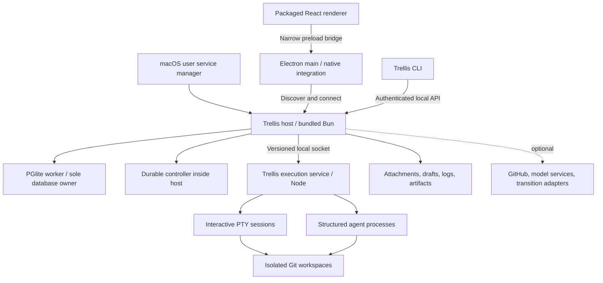

# Trellis desktop plan

Trellis should become a desktop application with its own local host and execution service. The host should own ticket state and agent coordination. The execution service should own agent processes and terminals. The desktop should expose work, output, and required decisions in one place.

This document records the design and release gates. Read [implementation status](implementation-status.md) for the code and verification results. It targets macOS first. Windows and Linux remain later targets behind the same runtime protocol. The desktop keeps the existing React interface, Base UI components, oRPC contract, Bun server, and PGlite database.

The design follows Superset's separation of processes. It adds a durable ticket controller because terminal persistence does not fix missed manager triggers. The [Superset study](superset-research.md) supplies the source evidence. The [screen concepts](wireframes.svg) show the proposed information hierarchy.

## 1. Product outcome and release boundary

A person should create a ticket, let Trellis work, and return to a concrete result or a specific request. The person should not need to inspect several terminal applications to determine whether work exists.

The readiness audit establishes the starting point. RDT-1 produced four passing tests after a manual manager wake. Automatic wake failed in the observed interval. A folder-trust prompt appeared as `running`. The manager created a shell poll to observe worker completion. These failures define the first release gates.[^1]

The first release includes local projects, automatic assignments, one manager per project, deliberate parallel workers, integrated terminals, output evidence, and recovery after host restart. It preserves local tickets, reviews, attachments, personas, and flow definitions. It includes a complete local ticket-to-review test.

The first release does not require Superset, tmux, a browser gateway, or a Trellis cloud account. Hosted models and GitHub remain optional feature dependencies. Git and the chosen agent executable remain local tools unless Trellis explicitly bundles them.

| Dependency | First desktop release | Complete independence |
| --- | --- | --- |
| Superset app, CLI, host, relay | Native runtime replaces them for new local runs | Remove the transition adapter after old runs finish |
| Browser and localhost gateway | Packaged desktop assets; direct local API | Keep legacy links only as compatibility entry points |
| Global Bun or Node installation | Bundle the required runtimes | No machine-wide runtime prerequisite |
| Agent executable and model account | Detect an existing installation and its capabilities | Local-model adapter required for fully offline agents |
| Git | Explicit local prerequisite | Bundle only after a separate distribution decision |
| GitHub and `gh` | Optional PR and CI support | Local files, Git changes, and local review work offline |
| Margin | Existing local review interface during transition | Compatible CLI backed by one canonical local store |
| Dots | Optional existing review-flow adapter | Native flow execution in a later parity phase |

The initial desktop release is independent for core ticket execution. Complete feature independence also requires the native flow phase and the review cutover. A desktop wrapper alone satisfies neither boundary.

## 2. Architecture decision

Use Electron for the first desktop release. Reuse the built `apps/web` renderer. Put native menus, windows, deep links, notifications, and service registration in `apps/desktop`. Keep Node access out of the renderer.

Electron fits the existing TypeScript interface and the required xterm integration. Tauri can also package sidecars, but it adds a Rust/native bridge while Trellis still needs its existing server and a PTY runtime. This comparison concerns migration cost. It does not claim that Electron has lower memory use.[^2]

Keep Bun for the host initially. Trellis uses `Bun.serve`, Bun file APIs, and a database worker. A simultaneous Node port would enlarge the first reliability change. Package Bun with the host, including PGlite assets and worker entry points. Validate the packaged result before committing to a compiled executable.[^3]

Use Node for the execution service. Superset's tested PTY implementation depends on Node behavior. This choice contains native terminal work in one process. It does not require an external Node installation.[^4]

These are responsibility boundaries, not separate products. The host, controller, and API ship together. PGlite retains its worker boundary. The execution service has no ticket logic and cannot write the ticket database.

### Module placement

| Location | Responsibility |
| --- | --- |
| `apps/desktop` | Electron main, preload, native helper, package configuration |
| `apps/web` | Shared React renderer and desktop capability adapter |
| `apps/server` | Existing API, database worker, controller, runtime adapter, local authentication |
| `apps/runtime` | Node executable that owns processes, PTYs, output buffers, and runtime identity |
| `packages/runtime-protocol` | Side-effect-free schemas and protocol types |
| `packages/api` | Assignment, attempt, evidence, attention, and client contracts |
| `packages/ui` | Terminal container, evidence view, status controls, and work-area components |
| `packages/cli` | Host discovery, compatible commands, and diagnostics |

The desktop loads the renderer build rather than importing UI packages into its main process. Server services retain `(ctx, tx, input)` and queries retain `(tx, input)`. External process calls run outside database transactions.[^3]

### Service ownership and app lifetime

Use one host per `TRELLIS_HOME`. Register the packaged host as a user service through macOS Service Management. The native helper should expose registration status, including a disabled background item. Apple supports this mechanism through `SMAppService` on macOS 13 and later.[^5]

For development, the existing CLI service installer remains useful. The production installer must replace its registration during a controlled cutover. It must not register a second writer beside `com.trellis.server`.

The host starts or adopts one execution service under a cross-process lock. Both services publish versioned identity records. Each record includes an instance identifier, process start identity, protocol version, and endpoint. A PID alone does not authorize adoption or termination.

The desktop and CLI attach to the same host. Neither opens PGlite. A second app window creates a client, not a second controller. A host crash lets macOS restart the host, which then reconciles existing runtime sessions.

| Action | Contract |
| --- | --- |
| Close a window | Keep host, assignments, and terminal processes active |
| Quit the desktop | Close the UI; background work continues when background work is enabled |
| Disable background work | Drain or explicitly stop active work before service removal |
| Pause a project | Stop new assignments and manager turns; let active workers finish |
| Stop an agent | Terminate that attempt; preserve its conversation, worktree, and output |
| Stop all work | Persist the stopped policy, then stop active attempts |
| Sleep or logout | Expose interruption; do not promise execution while the machine cannot run |
| Wake or login | Reconcile state and due work before any replacement launch |

The setup flow explains background behavior once. The menu always exposes Stop all work and the current background state. Notification delivery while the UI is absent requires a verified native helper path. The durable attention queue remains authoritative if notifications are unavailable.

## 3. Terminal and process service

The runtime protocol should expose `hello`, `ensureSession`, `listSessions`, `attach`, `writeInput`, `resize`, `signal`, and `closeSession`. Every mutation carries a request identifier. Every session identifies its attempt and generation.

`ensureSession` must return the same session for a repeated launch identifier. The runtime reserves that identifier before it starts the child. A lost response does not authorize another child. After a host restart, the host queries the runtime by that identifier.

Support two transport modes. PTY mode serves interactive shells and agent interfaces. Structured mode serves harnesses with a verified machine interface over standard input and output. Both modes keep their child process outside the host's lifetime. Structured output appears as events and logs, not as a fake interactive terminal.

The terminal data path uses bytes and sequence numbers. It must preserve split UTF-8 sequences, control bytes, alternate screens, resize behavior, and bracketed paste. A reconnect carries the runtime epoch and the last consumed sequence. A buffer gap produces an explicit reset or gap indication.

Keep bounded memory buffers for reconnect. Store bounded output segments on disk for later inspection. Link those segments to an attempt and sequence interval. Keep artifact metadata in PGlite. A terminal screen snapshot is not a complete log or a saved conversation.

The first release supports one active input owner per terminal. Additional views can observe it. A visible Take control action transfers input ownership. A manager message must not interleave with a person's keyboard input.

Set limits for output memory, disk retention, and slow clients. Measure them with representative agent output before release. Backpressure must not let a hidden terminal freeze the host or the desktop. Disk exhaustion must produce an actionable host error, not silent output loss.

A host restart must preserve sessions. A runtime crash has a different contract: mark affected attempts interrupted or unknown. Confirm process termination before replacement. Surviving descendants must not receive a duplicate writable assignment.

Defer descriptor handoff. Keep the active runtime version until its sessions finish. An incompatible update requires a visible drain or stop decision. Do not claim that ordinary conversation resume preserves a live shell's process state.

## 4. Agent capability contract

Certify one harness for unattended work before adding more. Start with the harness used by the existing manager and builder personas. Verify a second harness separately. Do not infer support from its executable name.

Each adapter declares capabilities for launch, resume, ready state, turn start, turn end, permission requests, structured input, cancellation, and conversation lookup. The runtime records the adapter version and account profile on each attempt.

An unattended adapter needs a reliable dispatch boundary. Prefer a documented structured request identifier. Where only PTY input exists, verify prompt readiness and a correlated turn acknowledgement. Terminal creation and a successful byte write do not establish either condition.

If an adapter cannot establish acknowledgement, classify it as interactive-only. It can still run inside Trellis. It must not carry the unattended-work guarantee. For a structured per-turn process, serialize turns against the saved conversation and wait for a confirmed exit before the next turn.

Install hooks at a supported scope. Preserve unrelated account configuration and existing integrations. Bind hook events to a specific attempt with a scoped token or verified launch identity. Ignore stale events from an earlier generation.

Trust configured repository directories and agent workspaces through each harness's supported configuration. Expose missing executable, expired authentication, unsupported version, and missing conversation as separate setup or run states.

## 5. Durable coordination

The controller is ordinary host code. It is not an LLM that must remember to stay awake. The manager agent makes planning decisions; the controller schedules and records those decisions.

### Data model

| Record | Purpose and key invariant |
| --- | --- |
| `project_controllers` | Desired mode, manager identity, generation, next due time; one per project |
| `assignments` | One logical task, role, scope, input revision, and acceptance contract |
| `execution_attempts` | One attempt for an assignment; runtime, session, conversation, generation, observed state |
| `controller_events` | Durable events with sequence, actor identity, project, cause, and deduplication key |
| `agent_deliveries` | Pending, claimed, acknowledged, completed, failed, or unknown delivery |
| `workspaces` | Repository identity, base revision, path, branch, ownership, and retention state |
| `artifacts` | Files, changes, commands, exit codes, review verdicts, and their revision |
| `attention_items` | A durable condition, its reason, action, acknowledgement, and resolution |
| `desktop_drafts` | Draft content, entity, window identity, base version, and save acknowledgement |

Reuse current run identifiers where possible. Introduce explicit attempts instead of overwriting execution history on a reused manager row. Keep the existing persona snapshot and session history. The final schema should expose one execution path.

### Event and delivery sequence

1. Commit the ticket change and its controller event in the same transaction.
2. Select eligible events by project and actor identity.
3. Create or update the pending manager delivery under a stable identifier.
4. Claim the delivery with the current controller generation.
5. Dispatch outside the database transaction.
6. Record the runtime result and the agent acknowledgement separately.
7. Commit accepted decisions and their resulting assignments in one transaction.
8. Publish UI notifications after commit.

Each delivery retains its input event range. A ten-second coalescing window can combine nearby updates, but it needs a maximum age. Continuous activity must not postpone a manager forever. The proposed default maximum is ten seconds after the first eligible event.

The wake source is the durable queue. Timers improve response time; they are not the only copy of pending work. On startup, reconnect, and machine wake, the controller scans due deliveries and reconciles attempts.

Use a bounded periodic reconciliation sweep even when event transport works. Its job is to find missed observations and due work. It does not blindly resend commands. A new ticket must not depend on an open page, terminal output, or an agent-written shell poll.

### Duplicate prevention and stale actors

One active controller generation owns a project. One manager identity belongs to that controller. Database constraints protect active ownership. Every manager command and worker mutation carries its assignment and generation.

An assignment identity includes the ticket, role, scope, and input revision. A repeated request returns the existing assignment. Deliberate parallel work uses different scopes or roles. Two reviewers or a builder and reviewer remain possible when the policy permits them.

The controller counts active worker turns for concurrency. Confirmed idle workers retain their assignments without occupying slots. An unresolved attempt reserves capacity until reconciliation proves its state. Manager capacity is separate from worker capacity.

Reject Trellis mutations from a stale generation. This protects the database, but it cannot revoke arbitrary filesystem writes from a surviving process. Therefore, a replacement writable attempt requires confirmed termination or a separate workspace with explicit reconciliation.

Do not promise exactly-once external execution. If a crash occurs after input reaches an opaque CLI but before acknowledgement, delivery becomes unknown. Query correlated runtime or harness state. If that evidence cannot resolve the outcome, request a decision instead of launching again.

### Trigger policy

| Trigger | Controller behavior |
| --- | --- |
| Eligible ticket created or materially edited | Queue manager work with the current revision |
| Worker output ready | Validate evidence, then queue the manager or reviewer |
| Review submitted | Deliver the verdict once per recipient assignment |
| PR head or checks changed | Invalidate stale evidence and queue relevant work |
| Agent turn ended | Record idle state; do not infer ticket completion |
| Permission request | Create an attention item; suspend dependent dispatch |
| Runtime disconnected | Mark observation unknown; preserve desired state |
| Controller's own bookkeeping | Do not create a new planning loop |
| Flow step completed | Queue dependent steps through the same assignment API |

Actor classification uses stored role and run identity. It does not inspect display-name prefixes. Every event carries its cause so the controller can suppress self-generated loops.

## 6. State, output, and evidence

Store desired state separately from observed state. A project can desire automatic work while its runtime is unavailable. A process can exist while its agent waits for input. A completed turn can produce no usable result.

| User-facing state | Required evidence | Primary action |
| --- | --- | --- |
| Queued | Durable assignment without a claimed attempt | Inspect queue reason |
| Starting | Runtime accepted launch; harness not ready | Inspect launch output |
| Working | Correlated active turn | Open the work area |
| Waiting for input | Verified prompt or permission event | Answer the specific request |
| Idle | Turn ended; session remains available | Inspect pending work |
| Verifying | Required checks or evidence validation active | Open results |
| Ready for review | Acceptance evidence valid for current input | Review output |
| Paused | Explicit project policy | Resume project |
| Interrupted | Confirmed process loss | Resume the conversation if supported |
| Unknown | Runtime or delivery outcome unresolved | Inspect and reconcile |
| Failed | Confirmed failure with a reason | Fix the named cause |
| Stopped | Explicit stop complete | Inspect retained output |

A ticket reaches Ready for review only when its acceptance contract passes. A code task should identify the workspace, input revision, changed files, checks, exit codes, and review target. A research task can require a document and its sources instead. Task type determines evidence.

A passed check becomes stale after a relevant code change. Store its commit or content fingerprint. The UI must show which revision the check covers. A shell transcript that says “tests pass” is not a verified check record.

The host can run approved checks in the assignment workspace and capture their results. Repository scripts execute with local user authority. A Git worktree isolates files; it is not a security sandbox. The project setup must make that execution boundary clear.

For lack of progress, show the last turn event, last output byte, last artifact, and elapsed time separately. Use a project policy to raise an attention item. Do not kill a long task solely because its terminal is quiet.

## 7. Desktop information architecture

Keep full-page tickets. Keep project and ticket identity in the topbar. Preserve Back navigation to the originating list and its filters. The desktop adds a work area to this structure rather than replacing the ticket with a terminal grid.[^6]

The navigation contains Needs you, All tickets, Projects, Reviews, and Flows. Each project exposes Tickets, Manager, and Settings. Operators use `trellis doctor --json` for runtime status.

### Needs you

This is the default return view when unresolved attention exists. Group items by the required action: answer a question, grant a specific approval, inspect a failure, or review output. Each row identifies the ticket, agent, reason, elapsed time, and destination.

An acknowledgement marks an item seen. It does not resolve the underlying condition. A notification opens the same item. Repeated observations of one condition update one row instead of producing a notification storm.

Ready work shows concrete output: changed files, a document title, or a local review. Activity counts do not appear as the main result. Dismissal must not hide an unresolved blocked assignment.

### Ticket workspace

The default ticket view presents the description, acceptance criteria, properties, and a compact execution summary. The work area offers Overview, Changes, Checks, and Activity. A terminal dock opens for the selected attempt.

Overview answers: what is assigned, who owns it, what exists, and what needs a decision. Changes opens the workspace diff or linked review. Checks shows commands, revision, exit code, and output. Activity contains lifecycle and ticket events.

Agent selection changes the visible attempt without losing ticket context. An attempt selector preserves previous failures and conversations. The terminal dock attaches to the selected attempt. A closed terminal pane detaches the view and leaves execution active.

At a wide window, show ticket content and the work area side by side. At a narrow window, use one content area with tabs. Keep the ticket header and required action visible. Size thresholds follow content fit rather than an arbitrary device name.

### Project manager

Move operation out of the settings-only route. The Manager view shows automatic work state, current turn, queued deliveries, active assignments, capacity, and the next scheduled action. Show “Idle, no queued work” only when both facts are known.

Pause affects future dispatch. Stop affects a named attempt. These controls must not share an ambiguous play/pause meaning. The manager conversation remains available, but it is not the source of queue state.

General settings select the manager persona, worker policy, concurrency, and approval rules. Agent settings select an installed harness and account profile. Put raw command templates under Advanced. Preserve existing templates during migration.

### Reviews and flows

Keep local review threads, revision anchors, verdicts, and delivery acknowledgements. Keep current Margin commands valid during the transition. Select one canonical store before the cutover. Do not post agent findings to GitHub comments.[^7]

Reuse the existing flow editor and its draft behavior. A later native flow executor submits ordinary assignments. It must not create another manager scheduler or a separate worker pool. Flow gates consume recorded outcomes and revision-specific evidence.

### Desktop setup and recovery

Setup should connect a local repository, detect an agent, verify its capabilities, and run a scratch ticket. The final screen reports each observed stage: host, runtime, agent readiness, trigger, output, and review handoff.

A missing repository, lost conversation, or disabled background item must show its exact reason and one relevant action. Resume preserves the conversation when possible. Start a new conversation is a separate action with visible consequences.

A runtime disconnect leaves ticket content readable and drafts editable. The work area marks execution state unknown. Reconnect restores the selected ticket, attempt, pane, and scroll position. It does not create a new assignment.

### Native interaction and accessibility

Use native menus, folder selection, open-file actions, and application deep links. Open external websites in the system browser for the first release. Defer embedded browser panes and a general code editor.

Reserve window drag regions around the macOS controls. Keep interactive elements outside drag regions. Preserve normal text selection. Use the existing tokens, circular icon controls, tooltips, and Base UI behavior.

Give each pane a clear focus indicator and keyboard route. Scope terminal shortcuts to the terminal. Preserve control characters for the shell. Provide an explicit shortcut to leave the terminal and return to app navigation.

Check 900×650, 1280×800, and 1600×1000 windows as proposed validation sizes. Check 200% zoom, keyboard-only use, VoiceOver, reduced motion, and long titles. The compact layout must retain the required action and current state.

Do not announce every terminal byte through a live region. Announce state changes and required decisions. Keep raw output selectable and searchable. A structured summary must remain available beside the terminal.

## 8. Persistence, security, and diagnostics

The host remains the sole database owner. Use the existing data-home lock before PGlite opens. The desktop should display an incompatible or already-owned data home without opening a second database instance.[^3]

Persist ticket, flow, and review drafts with an entity identifier and base version. A save acknowledgement clears only the exact submitted draft. Edits made during a save remain pending. Import existing browser drafts before retirement of the old browser origin.

The desktop cannot read another browser profile's localStorage directly through its new origin. Supply an export/import path in the old web app. Validate draft counts and sample contents before the cutover. Keep a local recovery copy until acknowledgement.

Use owner-only socket and manifest permissions. Bind compatibility HTTP endpoints to loopback. Require authentication and origin checks for mutation and event transport. A random port is discovery, not authorization.

Keep the renderer sandboxed with context isolation and no Node integration. Expose named preload operations, not arbitrary filesystem or shell access. Validate IPC senders and external URLs. Render ticket Markdown and terminal links as untrusted content.[^8]

Scope agent credentials to the relevant run and project where the API supports that scope. Keep authentication tokens out of logs, URLs, artifacts, and exported diagnostics. Do not treat process isolation or worktrees as protection from a malicious local agent.

Provide `trellis doctor --json`. Report host instance, runtime version, protocol compatibility, database owner, queue age, last reconciliation, hook health, and unresolved attempts. Every failure should link to the relevant local log and next action.

An export should include bounded, redacted logs and a state summary. Include an explicit option for terminal content because it can contain private repository data. No diagnostic export should occur automatically.

## 9. Migration and rollback

Migrate execution ownership one project at a time. Do not let the legacy scheduler, persona path, and native controller own the same project. The migration must inspect both `agent_sessions` and `agent_runs`.[^1]

1. Back up the database, attachments, agent records, and browser drafts.
2. Inventory live sessions, workspaces, conversations, and unresolved deliveries.
3. Run the native controller in observation mode against copied or read-only state.
4. Compare proposed actions without dispatching any work.
5. Pause the project's old dispatch path and record the ownership change.
6. Drain existing attempts or retain their saved transport until they finish.
7. Enable native dispatch for new assignments in that project.
8. Complete the release gates before selecting the next project.

An existing Superset terminal cannot become a native PTY by changing its identifier. Retain its transport until it ends. A later native attempt can resume a supported conversation after ownership and process state are clear.

Preserve Superset worktrees in place initially. Record their real paths and repository identity. Do not move or delete them during automatic import. Native workspaces should use a Trellis-owned path under the data home or a configured workspace root.

The schema migration should be additive during the transition. Mark legacy rows as historical only after their active ownership ends. Remove old launch, refresh, settings, and test surfaces together after parity. Avoid an indefinite third active execution path.

The service cutover must release the old database owner before the new host opens the data home. Test this with the actual launchd registration. Do not rely on a port change to establish exclusive database ownership.

Rollback first disables native dispatch and preserves all new workspaces and output. Re-enable the old adapter only after active attempts are resolved. Before schema contraction, maintain compatible reads. After contraction, use an explicit restore or forward fix; an older binary must refuse an incompatible schema.

Restoration must preserve a copy of post-migration data. Restoring a backup is not permission to discard newly created tickets, drafts, or artifacts.

## 10. Delivery sequence

Each behavior change starts with a failing test. Database, app, and CLI changes require integration tests. Native process tests must use the packaged runtime as well as development code. These stages are implementation slices, not calendar estimates.

| Stage | Concrete deliverable | Exit gate |
| --- | --- | --- |
| 0. Packaged feasibility | Electron shell, bundled Bun host, Node PTY, PGlite worker, signed helper experiment | Installed app opens a scratch database and survives host restart without losing a PTY |
| 1. Runtime contract | Versioned protocol, identity, launch deduplication, attach, resize, stop, logs | Concurrent and repeated launch requests produce one process; byte and cleanup tests pass |
| 2. Durable controller | Assignments, attempts, event queue, generation checks, acknowledgements | Ticket event survives host death; no window is open; one assignment starts |
| 3. Harness certification | One supported unattended adapter, hooks, readiness, resume, permissions | No false Working state at trust prompt; lost response does not duplicate a turn |
| 4. Workspace and evidence | Worktree ownership, check runner, artifact contract, revision invalidation | A ticket produces inspectable output; stale checks cannot pass its gate |
| 5. Desktop work area | Needs you, ticket work area, manager queue, terminal dock, draft storage | A person can resolve a block and review output without Superset |
| 6. Controlled migration | Import map, legacy drain, service cutover, rollback path | One scratch project and then one selected real project pass the full workflow |
| 7. Installed release | Signed package, background service, updates, diagnostics, CLI bundle | Clean-machine, restart, sleep/wake, and update gates pass |
| 8. Full feature independence | Native flow execution and canonical review cutover | Review flow completes with Superset, Dots, and Margin servers stopped in a test environment |

Stage 0 must precede broad UI work. Its output resolves the largest package risks: PGlite assets, Bun workers, native PTY ABI, helper registration, and runtime survival. If this package fails, revise the runtime choice before the controller expands. Stage 0 must also verify the existing signing identity and background-item requirements.

Stage 2 can first use a deterministic fake harness. Stage 3 then proves the real harness boundary. The two stages must not confuse reliable queue behavior with reliable model behavior.

Use small draft PRs within each stage. Keep terminal protocol, controller schema, harness adapter, and UI changes independently reviewable. Record the detailed test evidence in the repository or local review tool. Keep PR descriptions short.

### Version and update policy

Pin exact dependencies when implementation starts. Verify current releases and their native compatibility then. Do not copy Superset's snapshot pins without a fresh compatibility test.

Build architecture-specific packages. Use the correct ABI for the runtime that loads `node-pty`. Include PGlite assets, migrations, workers, hooks, and the CLI. Test an installation without a source checkout or global Bun/Node.[^9]

Keep compatible host and runtime versions discoverable during an update. Do not remove files that a live runtime still needs. The update experiment must prove that a signed runtime can survive application replacement and later launch a new child.

Use signed and notarized macOS distribution. Test the background helper's identity after app replacement. A protocol mismatch should offer an explicit drain or stop path. An app update must not silently kill active work.[^9]

## 11. Release tests

| Scenario | Required result |
| --- | --- |
| New ticket while manager is idle | Durable delivery becomes due within the configured ten-second maximum |
| Ticket created with all windows closed | The same automatic workflow starts |
| Host killed after event commit | Restart recovers the event without duplicate assignment |
| Host killed after process start but before response | Runtime lookup returns the existing process |
| Delivery outcome unknown | State shows Unknown; no blind resend or replacement |
| Two manager starts from separate clients | One active manager ownership record and one execution attempt |
| Repeated worker request | Same assignment returned |
| Deliberate builder and reviewer scopes | Both allowed within project capacity |
| Old generation posts a mutation | Host rejects it; current state remains unchanged |
| Runtime dies with descendants | Replacement waits for confirmed termination or explicit reconciliation |
| Authentication blocks launch | Needs you shows the cause; Working does not appear |
| Turn stops without required output | Ticket does not advance to Ready for review |
| Agent produces repetitive output | UI separates activity from evidence and exposes the elapsed condition |
| Source changes after tests pass | Check evidence becomes stale |
| Reviewer finishes while manager is idle | Verdict creates a durable manager delivery |
| Missing workspace or conversation | Exact failure state; retained history remains readable |
| Terminal reconnect and high output | Ordered bytes, bounded memory, visible gaps, responsive UI |
| Stop during launch or resume | No child appears after the completed stop |
| Close a terminal pane | Process continues; reopen attaches to the same attempt |
| Crash during draft save | Last unacknowledged draft remains recoverable |
| Host and old launch agent start together | Only one process opens the data home |
| Sleep, wake, logout, login | Correct interruption and reconciliation; no duplicate work |
| Incompatible update | Explicit blocked update or drain; no silent session loss |
| Network unavailable | Local tickets, drafts, terminals, and local evidence remain usable |
| Untrusted renderer content | No unrestricted filesystem, shell, or IPC capability |

Repeat the RDT-1 shape first with a deterministic harness, then with the certified real harness. Require output files, independent checks, and the final local review state. Capture assignment counts and event timestamps.

Add a real PR case before claiming GitHub workflow readiness. It must cover a new head revision, CI results, local review feedback, and a manager wake. GitHub comments remain outside the agent review channel.

Use a proposed 24-hour unattended soak across several scratch tickets before the first real-project cutover. Include output-heavy, blocked, idle, and failed attempts. Report measured resource use and queue delay. A successful single ticket is necessary but insufficient.

## 12. Remaining decisions

The platform scope is macOS first. The proposed helper API requires macOS 13 or later. Confirm supported OS versions and processor architectures before Stage 0 ends.

The first unattended harness must pass its capability contract. If it cannot acknowledge dispatch reliably, use a structured per-turn mode or revise the supported release boundary. Do not weaken the duplicate-work gate to preserve an interactive interface.

The signed package experiment must settle runtime placement and upgrade retention. It must also settle whether the Bun host compiles cleanly or ships with an explicit bundled runtime. Both choices preserve the existing server code.

Native flow execution and review-store cutover determine the full independence date. The core desktop release can precede them, but its release notes must name those remaining optional integrations.

## Sources

[^1]: [Superset study, Trellis audit findings](superset-research.md#8-what-the-trellis-audit-establishes), including the RDT-1 local evidence and current dispatcher source. These are observations; the release behavior in this plan is proposed.
[^2]: Electron, [Process Model](https://www.electronjs.org/docs/latest/tutorial/process-model); Tauri, [Embedding External Binaries](https://v2.tauri.app/develop/sidecar/). The framework choice is an architectural recommendation.
[^3]: Trellis, [server boot](../../apps/server/src/index.ts#L48), [architecture](../ARCHITECTURE.md), and [database transport](../../apps/server/src/db/transport.ts). Bun, [Single-file executable](https://bun.sh/docs/bundler/executables), including worker entry points and embedded assets.
[^4]: [Superset study, terminal runtime](superset-research.md#2-how-terminals-run). Microsoft, [node-pty](https://github.com/microsoft/node-pty), including platform support and execution permissions.
[^5]: Apple, [SMAppService](https://developer.apple.com/documentation/servicemanagement/smappservice). The helper lifecycle and package integration remain Stage 0 verification work.
[^6]: Trellis, [ticket page](../../apps/web/src/features/ticket/TicketView/TicketView.tsx) and [manager page](../../apps/web/src/features/project-manager/ProjectManagerPage/ProjectManagerPage.tsx). Proposed layout: [screen concepts](wireframes.svg).
[^7]: Trellis, [local review architecture](../ARCHITECTURE.md#pull-request-reviews), [review guide](../reviews.md), and [delivery service](../../apps/server/src/services/reviews/delivery.ts). Existing local review rules retain Margin as the review interface until an explicit cutover.
[^8]: Electron, [Security](https://www.electronjs.org/docs/latest/tutorial/security) and [Process Sandboxing](https://www.electronjs.org/docs/latest/tutorial/sandbox).
[^9]: Electron, [Native Node Modules](https://www.electronjs.org/docs/latest/tutorial/using-native-node-modules) and [Updating Applications](https://www.electronjs.org/docs/latest/tutorial/updates). [Superset study, packaging](superset-research.md#6-packaging-and-updates).
