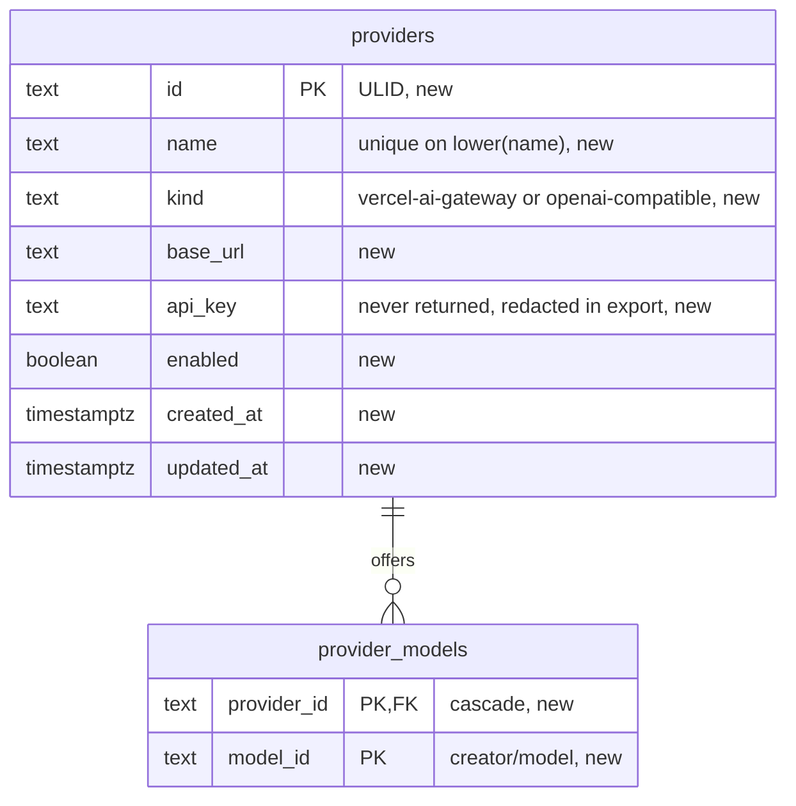

# Providers

Proposed on 2026-09-23 for TRL-428, epic Jev. A provider is an external model gateway that Trellis holds a key for: a name, a kind, a base URL, an API key, an enabled flag, and the models that Trellis offers from it. The first kind is Vercel AI Gateway. The second kind is any OpenAI-compatible endpoint.

The plan has four parts. Part 1 is the research: what the gateway gives, what Trellis has, and where Trellis makes a judgement that Jev can answer. Part 2 is the design of the provider record, its API, its CLI, and its web surface, with every state and every word. Part 3 is the build: tickets, tests, evidence, and documents. Part 4 is what comes after the CRUD: the Jev call, a flow gate that Jev answers, a launch through a provider, and cost.

Decisions taken in this plan, each with its reason in its section:

1. The key is a column in the database, never returned by the API, redacted in the export.
2. A provider is global, not per project. One machine, one person, one bill.
3. Providers live on the Usage page under Accounts, with the account card and the account form as their shapes. No new element.
4. The model set of a provider is free text with a shape check, not a catalog check, because `typesafe-ai/jev` is not in the catalog.
5. The first consumer of a provider is a flow gate that Jev answers. It replaces a full agent run that answers YES or NO.
6. Only a person can create, change, or remove a provider. An agent reads.

Out of scope for the CRUD tickets: the Jev call, the flow gate, a launch through a provider, the cost report, encryption at rest, more than one key per provider, a provider per project, a mobile screen.

## Part 1. Research

### 1.1 What Vercel AI Gateway gives

The facts below come from the Vercel documentation read on 2026-09-23.

| fact | value |
|---|---|
| Base URL | `https://ai-gateway.vercel.sh`. REST and OpenAI-compatible calls sit under `/v1`. |
| Coding agent surface | `/coding-agent/v1` passes through to `/v1` and marks the traffic. Claude Code uses `/claude-code`, Codex uses `/codex/v1`, Cursor uses `/cursor/v1`. |
| Authentication | `Authorization: Bearer <key>`. A key belongs to a Vercel team. The dashboard shows a key once. The Vercel CLI masks a key as `vck_••••1234`. |
| Key creation | The dashboard, or `vercel ai-gateway api-keys create --name <n> [--limit <usd> --refresh-period monthly] [--expiration 7d]`. A key can carry its own spend limit. |
| Key storage by the Vercel CLI | `vercel ai-gateway setup` writes the key to the macOS Keychain as a generic password with the service name "Vercel AI Gateway", and writes each agent config to point at the gateway. Pi always keeps the key in `$PI_CODING_AGENT_DIR/auth.json`. OpenCode keeps it in `opencode.json` under `XDG_CONFIG_HOME` or reads `AI_GATEWAY_API_KEY`. |
| `GET /v1/models` | No authentication. `{ object: "list", data: [{ id, name, type, tags, context_window, max_tokens, pricing, reasoning_options? }] }`. `id` is `creator/model`. `type` is `language`, `embedding`, `reranking`, `image`, or `video`. |
| `GET /v1/models/{creator}/{model}/endpoints` | No authentication. Per-provider pricing, uptime, and latency for one model. |
| `GET /v1/credits` | Needs the key. `{ balance: "95.50", total_used: "4.50" }` in USD. A bad key answers 401. |
| `POST /v1/evaluate` | Needs the key. `{ model: "typesafe-ai/jev", state, questions }`. A question is `boolean` (a probability), `choice` (a `choice` and a probability per option), or `score` (a `score` and a probability per rung). The answer carries `usage` and the cost. |
| `GET /v1/report` | Needs the key and a paid team. Spend by day, model, provider, user, tag, or API key. |
| Errors | 400 invalid body, 401 bad key, 403 plan too low, 404, 500, 503. The body is `{ error: { message, type } }`. |

Jev is a decision model from TypeSafe AI. It answers typed questions about a piece of state and returns no prose. Vercel lists seven uses: form routing, ticket prioritization, tool-call review, response model selection, document categorization, moderation flagging, and response evaluation. Its recommended patterns: accept a choice only when its probability meets a threshold, test the threshold against the cost of a mistake, run a "clear" call and hold a "caution" call for a person, and keep reviewer labels beside the model's answers before the use expands.

### 1.2 What Trellis has

- `harness_accounts` holds a name, a harness, and a profile path. The harness CLI owns every credential. `credentials.ts` reads them on demand from the profile files and from the macOS Keychain through `security find-generic-password`. The table stores no key.
- No table holds a usable secret. The one secret in the database is `agent_execution_attempts.token_hash`, a hash. The desktop host token is a plain file, `desktop-token`, mode 0600, in the data home.
- `exportNdjson` in `apps/server/src/services/system.ts` dumps every base table. There is no import.
- The model catalog `packages/api/src/models/catalog.json` already holds gateway ids. `scripts/update-model-catalog.ts` reads `GET /v1/models` and keeps the tool-capable language models of google, anthropic, meta, and openai. `modelsForHarness` gives Pi and OpenCode the whole catalog and filters the rest. `typesafe-ai/jev` is not in the catalog.
- Pi and OpenCode already launch through the gateway: `toHarnessModel` writes `vercel-ai-gateway/<id>` and `vercel/<id>`. Their key lives in the harness profile, outside Trellis. `profileEnvironment` in `apps/server/src/services/harnessAccounts/profiles.ts` removes every `*_API_KEY` from the launch environment of Pi, OpenCode, and Muse.
- No LLM call exists in `apps/server/src` or `packages/api/src`. Every judgement is a rule, a regex, or a full agent run.
- The web has no password input, no reveal control, and no secret field. `Input` passes `type` through to the native input. Copy to clipboard exists: `writeClipboard`, a Copy `IconButton`, and `toast`.
- The mobile app has no accounts screen and no usage screen.
- The CLI has no flag that takes a secret. Secrets reach it through environment variables only. `readText(ctx, "-")` reads the whole standard input.
- `ProviderIcon` draws four marks: anthropic, openai, meta, google. There is no gateway mark.

### 1.3 Where Trellis judges by rule today

Each row is a place where a typed answer from Jev can replace a regex, add a gate, or pre-score a decision. The input column names the fields at hand at that moment. The cost column says what a wrong answer costs.

| decision | code | input at hand | answer shape | cost of a wrong answer |
|---|---|---|---|---|
| Flow gate and loop condition | `flowExecutions/claimNext.ts:47`, `nativeFlow/parseFlowDecision.ts` | the node instruction, the outputs of the earlier steps | boolean | medium: a wrong YES skips remediation; an unparseable answer stalls the run and needs a person |
| Human step in a flow | `flowExecutions/decide.ts` | the step instruction, the earlier outputs | boolean, by a person | costly by design; Jev can pre-score, never decide |
| Finding severity | `reviews/threads.ts`, `reviewReady.ts` | the thread body, path, line, anchor lines | choice: blocking, should-fix, nit | medium: today every open thread blocks readiness |
| Finding addressed by a later push | `reviews/threads.ts:119-128` | the thread body, the hunk at the new head | boolean | medium: any actor can resolve a thread, and nothing checks the fix |
| Evidence proves the change | `evidence/evidence.ts:73-87` | the evidence body, the contract `verify` and `result` | score: none, claims only, command output, output that matches `verify` | costly: an off-topic document clears the evidence gap |
| Flow waiver reason | `flowWaiver/flowWaiver.ts:60-79` | the reason, the changed paths, each flow's name and description | boolean per flow: does the reason exclude this flow | costly: the waiver bypasses review by a flow |
| Flow selection by the agent | `brief/flowLines.ts:17-24` | the flow descriptions, the changed paths, the summary | boolean per flow | medium: a missed flow is a missed review |
| Path risk groups | `prPaths/prPaths.ts:55-78` | the path, the change type, the repo | choice of four groups, five risk flags | medium: a neutral file name hides an auth change |
| Data model diagram required | `prPaths.ts:84-106`, `ready/pullRequestReady.ts:54-67` | the paths, the summary text, the evidence text | boolean required, boolean present | medium: a false required blocks `trellis ready` |
| Dependency parse | `tickets/importDeps.ts` | the ticket descriptions of an epic | boolean per pair: A waits on B | medium: a false edge blocks `ready`; a missed edge starts an agent early |
| Agent turn end | `sessionStatus.ts`, `sessionAlerts.ts` | the last message text, the last tool, the contract, the review gaps | choice: finished, blocked, asked a question in prose, mid-work | medium: a prose question is invisible today; only a harness event counts |
| Check failure cause | `gh/checkNotice.ts`, `gh/failureLines.ts` | the check name, the annotation lines, the changed paths | choice: caused by the change, flaky, infrastructure | medium: every failure goes to the agent today |
| Auto-done on merge | `tickets/completeMergedPullRequests.ts` | the merged diff, the contract `result` | boolean: the merge meets the result | medium: a ticket can go done without its result |
| Contract `leaveAlone` | `tickets/contract.ts` | the changed paths and hunks, the `leaveAlone` list | boolean per entry | costly: the field is stored and never checked |
| STE refusals | `steCheck/steCheck.ts:62-110` | one text field | boolean per rule: starts with a verb, is a real noun cluster | cheap: a false refusal costs one rewrite |
| Tool call gate | Claude `PreToolUse` hook, Muse `answerMuseRequest`, OpenCode plugin | the tool name, the target, the contract, the worktree | choice: allow, ask a person, deny | costly both ways: a wrong deny stalls, a wrong allow destroys |

The first use in the epic is the flow gate. The reasons: a gate is already a boolean, the instruction is already a question, the earlier step outputs are already the state, and today a full harness agent starts a process to say one word. Jev answers in one call for about 300 input tokens. The second use is the evidence score, because the evidence gap is the one that most often clears with nothing behind it. The third is the agent turn end, because a question in prose reaches nobody today. Each use needs a provider first. Part 4 designs them.

## Part 2. Design

### 2.1 Data model

Table `providers`, in `apps/server/src/db/tables/providers.ts`, exported from `apps/server/src/db/schema.ts`:

| column | type and constraint |
|---|---|
| id | text PK, ULID |
| name | text NOT NULL, CHECK trimmed and 1 to 120, UNIQUE index on `lower(name)` |
| kind | text NOT NULL, `checkIn(kind, PROVIDER_KINDS)`: `vercel-ai-gateway`, `openai-compatible` |
| base_url | text NOT NULL, CHECK length 1 to 2000 |
| api_key | text NOT NULL, CHECK length 1 to 4000 |
| enabled | boolean NOT NULL DEFAULT true |
| created_at, updated_at | `at()` NOT NULL |

Table `provider_models`, in the same file:

| column | type and constraint |
|---|---|
| provider_id | text NOT NULL, FK providers(id) ON DELETE CASCADE |
| model_id | text NOT NULL, CHECK matches `^[a-z0-9-]+/[a-z0-9._-]+$` |
| | PK (provider_id, model_id) |

A row in `provider_models` is a model that the provider offers in Trellis. The API reads the set as `models: string[]`, sorted. An update with `models` replaces the whole set in one transaction: delete the rows of the provider, insert the new rows. The set is not checked against the catalog. `typesafe-ai/jev` and an OpenAI-compatible endpoint both serve ids that the catalog does not hold.

`base_url` has a default per kind in the API, not in the database: `https://ai-gateway.vercel.sh` for `vercel-ai-gateway`. An `openai-compatible` provider needs an explicit URL. The URL is stored without a trailing slash and without `/v1`. A caller appends the path it needs, because the gateway has more than one surface.

A provider is deleted, not archived. Nothing references a provider today. The Part 4 ticket that adds `agent_runs.provider_id` adds it with ON DELETE SET NULL, so a deleted provider leaves the run and its history keeps the run.

One migration, generated with `bun run db:generate` and numbered after the newest journal tag, which is `0114_status_without_reviewer` on 2026-09-23. Keep the snapshot. The SQL holds the two tables, their checks, the unique index, and the primary key. Never edit an earlier migration.

The entity diagram:



### 2.2 Where the key lives

The key is a column in the database. The reasons:

- Trellis runs for one person on one machine. The data home is mode 0700, and the desktop host token already sits there as a plain file. An agent runs as the same user and can read the database, a file, and the macOS Keychain through `security find-generic-password` alike. No store on this machine hides the key from an agent. The choice is about simplicity and about leaks in output.
- A column is written in the same transaction as the row. A file beside the row needs a prepare step and leaves an orphan when the transaction fails.
- The Keychain is what the Vercel CLI uses. Trellis rejects it as the store because it hides nothing from an agent that runs as the same user, and because a `security` call adds a subprocess to every read. Part 4 reads the Keychain entry of the Vercel CLI once, as an import.

Three rules keep the key out of every output:

- The API never returns `api_key`. `ProviderSchema` carries `keyLast4`, the last four characters. The row select in `rows.ts` never lists the column, so a new procedure cannot leak it by accident. One test asserts that `JSON.stringify` of every procedure output holds no key.
- `exportNdjson` gains `REDACTED_COLUMNS = { providers: ["api_key"] }`. The page query selects `'<redacted>' AS api_key` for a redacted column. There is no import, so the redaction breaks no round trip.
- The server log never prints a provider row. The catalog and check services log the status code and the host, not the header.

### 2.3 API

A provider has no ref grammar. The API takes the ULID, as `harnessAccounts` does. Schemas in `packages/api/src/schemas/provider.ts`, re-exported from `schemas/index.ts`:

```
ProviderKindSchema = z.enum(["vercel-ai-gateway", "openai-compatible"])
ProviderModelIdSchema = z.string().regex(/^[a-z0-9-]+\/[a-z0-9._-]+$/, "Write a model id as creator/model, such as anthropic/claude-opus-5.")
ProviderSchema = { id, name, kind, baseUrl, keyLast4, enabled, models: ProviderModelId[], createdAt, updatedAt }
ProviderCreateInputSchema = { name, kind, baseUrl?, apiKey, enabled?, models? }
ProviderUpdateInputSchema = { id, name?, baseUrl?, apiKey?, enabled?, models? }   // an absent field keeps its value
ProviderIdInputSchema = { id }
ProviderCatalogEntrySchema = { id, name, type }
ProviderCatalogSchema = { ok: boolean, detail: string | null, fetchedAt, models: ProviderCatalogEntry[] }   // ok false: the fetch failed, models is empty, detail says why
ProviderCheckSchema = { ok: boolean, balance: string | null, detail: string | null, checkedAt }
```

Field rules, with the message a person reads:

| field | rule | message |
|---|---|---|
| name | trim, 1 to 120 | "Enter a provider name of 1 to 120 characters." |
| kind | one of two | "Choose Vercel AI Gateway or an OpenAI-compatible endpoint." |
| baseUrl | `z.string().url()`, `https` only, trailing slash and a trailing `/v1` removed; required when kind is `openai-compatible`; defaults when kind is `vercel-ai-gateway` | "Enter the https address of the endpoint, without /v1." |
| apiKey | trim, 1 to 4000 | "Paste the API key of the provider." |
| enabled | boolean, default true | |
| models | array of ProviderModelId, unique, at most 200 | the id message above; "A provider offers at most 200 models." |

Every input is a `z.strictObject`. A `PATCH` with `apiKey` replaces the key. A `PATCH` without `apiKey` keeps it. There is no way to read a key back.

Contract `packages/api/src/contract/providers.ts`, registered in the contract index as `providers: oc.tag("providers").router(providers)`:

| procedure | route | errors | output |
|---|---|---|---|
| providers.list | GET /api/providers | | Provider[], by name |
| providers.get | GET /api/providers/{id} | NOT_FOUND | Provider |
| providers.create | POST /api/providers, 201, `Location: /api/providers/{id}` | DUPLICATE | Provider |
| providers.update | PATCH /api/providers/{id} | NOT_FOUND, DUPLICATE | Provider |
| providers.delete | DELETE /api/providers/{id} | NOT_FOUND | { id } |
| providers.catalog | GET /api/providers/{id}/catalog?refresh= | NOT_FOUND | ProviderCatalog |
| providers.check | GET /api/providers/{id}/check?refresh= | NOT_FOUND | ProviderCheck |

Errors:

- A taken name, compared case-insensitive, is `DUPLICATE` with field `name`. The CLI prints `error: A provider with this name exists. Field: name. (DUPLICATE)` and exits 4.
- A missing id is `NOT_FOUND` with kind `provider`. The CLI exits 3.
- A mutation from an agent actor fails with `invalidInput("actor", "Only a person can manage providers.")`, the rule of `harnessAccounts`. A person pastes the key, and an agent must not create a record that spends money. The CLI exits 4.
- A catalog or check that cannot reach the endpoint is not an error. The answer carries `ok: false` and a `detail`, in the pattern of the quota service. A 503 code would turn a bad key into a CLI exit 6 and a red failure block, and a bad key is a normal state of a provider.

`providers.catalog` fetches `GET <baseUrl>/v1/models` and returns the `language` entries as `{ id, name, type }`, sorted by id. The gateway needs no key for that call. An OpenAI-compatible endpoint gets the key in the header, because the OpenAI format requires one. The answer is cached for 5 minutes per provider, and `refresh` shortens the cache to 1 second, the shape of `prepareQuota`. The result shape separates two states that both hold no model: a successful fetch of an endpoint with no language model answers `ok: true`, `detail: null`, `models: []`; a failed fetch answers `ok: false`, `models: []`, and `detail` from the failure table below. `ok: true` never carries a `detail`, and `ok: false` always does. The same shape serves `providers.publicCatalog`.

`providers.check` proves the key. A `vercel-ai-gateway` provider gets `GET <baseUrl>/v1/credits` with the key. A 200 answers `ok: true` and the balance as the string the gateway sent. An `openai-compatible` provider has no credits route, so the check calls `GET <baseUrl>/v1/models` with the key and answers `balance: null`. The mapping of a failure:

| result | ok | detail |
|---|---|---|
| 200 | true | null |
| 401 or 403 | false | "The provider refused the key." |
| other status | false | "The provider answered HTTP <status>." |
| timeout after 10 s, network error, bad JSON | false | "Trellis cannot reach <host>." |

The check is cached for 30 seconds per provider, and `refresh` shortens the cache to 1 second. Both reads run in the `prepare` step of the registry, outside the transaction, because a network call inside a PGlite transaction holds the one lane. The network is a system boundary, so these two services catch the fetch error and return it in `detail`. Nothing else in the provider code catches.

Event: `providers.changed` with payload `{ id }`, in the pattern of `flows.changed`. Every mutation emits it after commit. `packages/api/src/query-keys.ts` invalidates the `providers` family. The bus gives an event with no project an empty scope, so every subscriber receives it. `trellis watch` prints it as `{ "type": "providers.changed", "providersId": "..." }`, because `watch` renames `id` after the first segment of the type.

OpenAPI text in `apps/server/src/openapiText.ts`: a tag `{ name: "providers", description: "External model gateways with a stored key and the models they offer." }`, and the body examples `"POST /providers": { name: "Vercel", kind: "vercel-ai-gateway", apiKey: "vck_example", models: ["typesafe-ai/jev"] }` and `"PATCH /providers/{id}": { enabled: false }`.

### 2.4 Server code

`apps/server/src/services/providers/`:

| file | holds |
|---|---|
| `providers.ts` | `list`, `get`, `create`, `update`, `remove`, the person check, the name check |
| `rows.ts` | `providerColumns` without `api_key`, the `models` lateral as a sorted array, `toProvider` |
| `catalog.ts` | `prepareCatalog`: the cache, the fetch, the mapping |
| `check.ts` | `prepareCheck`: the cache, the fetch, the mapping |
| `secret.ts` | `keyOf(tx, id)`: the one function that selects `api_key`; the Part 4 callers use it |

Registry entries use the `io` family: `providers.list`, `get`, `create`, `update`, `remove` as `io(...)`, and `providers.catalog` and `providers.check` as `prepared("read", prepareX, agentTerminal.result)`. Procedures in `apps/server/src/procedures/providers.ts`, one line each, with `setLocation` on create. `create` and `update` use `LOCK TABLE providers IN SHARE ROW EXCLUSIVE MODE` before the name check, as `harnessAccounts.create` does, so two concurrent creates cannot both pass the check.

### 2.5 CLI

`packages/cli/src/commands/providers/providers.ts` with the specs and the input builders in `providersText.ts`, registered in `verbs.ts` after `accounts` as `providers: { description: "List, add, edit, check, or remove model gateways" }`.

```
trellis providers list
trellis providers show <id>
trellis providers add --name <text> --kind vercel-ai-gateway|openai-compatible --api-key - [--base-url <url>] [--model <id>]... [--disabled]
trellis providers edit <id> [--name <text>] [--base-url <url>] [--api-key -] [--enabled true|false] [--model <id>]... [--no-models]
trellis providers rm <id>
trellis providers catalog <id> [--refresh] [--all]
trellis providers check <id> [--refresh]
```

Rules:

- `--api-key` accepts only `-`. Any other value is a usage error, exit 2: `error: --api-key takes - and reads the key from standard input.` The key never sits in `ps` output or in shell history. The usage: `printf '%s' "$KEY" | trellis providers add --name Vercel --kind vercel-ai-gateway --api-key -`. `readText` trims the trailing newline that `echo` adds.
- `--model` repeats through `repeatedFlag`. On `add` it sets the list. On `edit` it replaces the list. `--no-models` on `edit` clears it. `--model` and `--no-models` together is a usage error.
- `--enabled` reads `true` or `false`, as `list.ts` reads `--blocked`. `--disabled` on `add` sets `enabled: false`.
- `add` and `edit` print the record. `rm` prints `deleted: <id>` through `deletedRecord`.
- `catalog` prints the models of the endpoint. Without `--all` it prints the first 50 rows and a last line `... <n> more; add --all`. In json mode it prints the whole result object. An `ok: false` result prints `error: <detail>` on stderr and exits 1, so a script sees the difference between no model and no answer.
- An agent actor that runs `add`, `edit`, or `rm` gets the refusal of the API, exit 4.

The list columns, in this order: `id`, `name`, `kind`, `enabled`, `models`, `key`. `models` is the count. `key` is `••••` plus the last four characters. The record fields of `show`: id, name, kind, base url, enabled, key, models (one per line, comma-joined in a table), created, updated. Times print through `shortZonedDateTime`.

The check record: provider, ok, balance, detail, checked. A pipe gets JSON, so a script reads `ok` from the object.

Examples:

```
$ trellis providers list
id                          name    kind                enabled  models  key
01M39...                    Vercel  vercel-ai-gateway   true     3       ••••1234

$ trellis providers check 01M39...
provider: Vercel
ok: true
balance: 95.50
detail: -
checked: 2026-09-23 21:04
```

The agent guide `packages/cli/src/instructions.md` gains one paragraph after the notes paragraph:

```
Providers: the model gateways that Trellis holds a key for. A person adds one in Usage. An agent reads them and never changes them.
Read the providers: trellis providers list
Read the models a provider offers: trellis providers show <id>
```

### 2.6 Web: where providers live

Providers live on the Usage page, Agent tab, in a section "Providers" directly under the Accounts section. The reasons:

- A provider is a paid login of the machine, as an account is. The page already answers "what can spend money here, and how much is left".
- The account card already draws every shape a provider needs: a name, a mark, a state line, a balance, a code line, and a circular action row.
- The Settings sheet caps a page at 720 px inside a `divide-y` column, and holds no create action today. A card grid does not fit there.

The alternative is a `providers` section in the Settings sheet with one `SettingsRow` per provider. It fits a list of two, and it fails at the card content: the balance, the refusal, and the models. This is the one open choice for Navid. The rest of the design does not change with it.

The palette gains a static item `goto.providers`, label "Providers", section `goto`, which navigates to `/usage#providers`. The Usage page scrolls to the section when the hash is set.

### 2.7 Web: the section

`apps/web/src/features/usage/UsagePage/components/UsageProviders/UsageProviders.tsx`, rendered by `AgentUsage.tsx` after `UsageAccounts`:

```
<section aria-label="Providers" id="providers" className="flex flex-col gap-3">
  <SectionHeader title="Providers" count={n} actions={<Tooltip content="Add provider"><IconButton label="Add provider" icon={<Plus />} onClick={openAdd} /></Tooltip>} />
  <p className="text-sm text-fg-muted">Add the model gateways that Trellis holds a key for. Trellis calls a provider itself, and a later release routes agents through one.</p>
  {state}
  <div className="grid grid-cols-1 gap-4 md:grid-cols-2 xl:grid-cols-3">{cards}</div>
</section>
```

The states, in the order a person meets them:

| state | what draws |
|---|---|
| loading | `<div role="status" aria-label="Load providers"><span className="sr-only">Load providers</span><Skeleton height="h-32" /></div>`; the count slot stays blank |
| empty | `<p className="text-sm text-fg-muted">No providers. Add a provider to give Trellis a key.</p>`; the count prints 0 |
| read error | `FailureState variant="section"` with the title "Trellis cannot read the providers." and the action Retry, which refetches; `detail` holds the error text |
| populated | one card per provider, by name |

The section never toasts on create, edit, or remove. The card changes in place through the invalidation. A copy action toasts, as the account card does.

### 2.8 Web: the card

`components/UsageProviderCard/UsageProviderCard.tsx`, an `<article aria-label={name} className="flex min-w-0 flex-col gap-3 rounded-lg border border-border p-4">`, top to bottom:

1. Header row, `flex items-start justify-between gap-2`.
   - Left: `<h3 className="flex min-w-0 items-center gap-2 text-md font-medium text-fg">` with a `GatewayIcon` in `text-fg-muted` and the name in `break-words`. Under it, `<p className="mt-1 text-xs text-fg-faint">` prints the kind label, "Vercel AI Gateway" or "OpenAI-compatible", then ` · Off` when the provider is disabled. Off is plain text, no color.
   - Right, `flex shrink-0 flex-wrap justify-end gap-1`, the action row:

   | tooltip | aria label | icon | rule |
   |---|---|---|---|
   | Edit provider | Edit {name} | PencilSimple | |
   | Check key | Check the key of {name} | ArrowClockwise | disabled while a check runs; `aria-busy` |
   | Turn off / Turn on | Turn off {name} / Turn on {name} | Power | writes `enabled`; `aria-pressed` |
   | Remove provider | Remove {name} | Trash | |

2. Address line: `<CodeText className="break-all text-xs text-fg-faint">{baseUrl}</CodeText>`.
3. Key line: `<p className="text-sm text-fg-muted">Key ••••{keyLast4}</p>`. There is no reveal. A person who lost the key mints a new one at the provider and pastes it in Edit.
4. State slot, one of:

   | condition | draws |
   |---|---|
   | check pending | `<p role="status" className="text-sm text-fg-muted">Checking the key…</p>` with a `Skeleton w-16 h-4` for the balance |
   | ok with a balance | `<p role="status" className="text-sm text-success">Key accepted · $95.50 left</p>`; the number is tabular |
   | ok without a balance | `<p role="status" className="text-sm text-success">Key accepted</p>` |
   | refused | `<p role="status" className="text-sm text-warning">The provider refused the key. Paste a new key in Edit.</p>` |
   | unreachable | `<p role="status" className="text-sm text-fg-muted">Trellis cannot reach ai-gateway.vercel.sh. Check the key again later.</p>` |
   | disabled | the state slot prints the last check as above; the Off word in the header carries the state |

   Yellow marks the one state a person clears, a refused key. Red is not used on the card, because nothing on it is a fault of the machine.
5. Models line: `<p className="text-sm text-fg-muted">3 models · typesafe-ai/jev, anthropic/claude-opus-5, openai/gpt-6-astra</p>`, truncated at one line with `truncate`, and the full list in a `Tooltip` on hover. Zero models prints "No models. Edit the provider to choose some."

The card does not print spend. Spend comes from the gateway report in Part 4.

The check runs once when the card mounts, from the 30 second cache, and again on Check key with `refresh`. The section polls `providers.list` every 30 seconds, as the accounts section does, and the SSE event covers a change from the CLI.

`GatewayIcon` is the only new visual. It is a `ProviderIcon` mark for `vercel` (the Vercel triangle, Simple Icons, CC0) and a generic plug mark for `openai-compatible`. It goes into `packages/ui/src/domain/ProviderIcon` as two more values of `ModelProvider`, so the `ModelPicker` of Part 4 can draw the same mark. This is the one addition to a canonical element, and it stays inside that element.

### 2.9 Web: the form

`packages/ui/src/domain/ProviderForm/ProviderForm.tsx`, a `Dialog` in the shape of `HarnessAccountForm`. One component serves Add and Edit; `provider` absent means Add.

| Add | Edit |
|---|---|
| title "Add provider" | title "Edit provider" |
| description "Give Trellis a key for a model gateway. Trellis stores the key on this machine and never shows it again." | description "Change the provider. Leave the key blank to keep the stored key." |
| submit "Add provider" | submit "Save" |

The fields, in order, inside `<form className="flex flex-col gap-4">`:

1. `Input label="Name"`, required, `maxLength={120}`, placeholder "Vercel", `autoFocus` on Add.
2. `Field label="Kind"` around `Select label="Provider kind"` with the items "Vercel AI Gateway" and "OpenAI-compatible". On Edit the kind is read only: the field prints the kind as text, because a kind change changes the meaning of the URL and the check.
3. `Input label="Address"`, shown for `openai-compatible` only, placeholder "https://api.example.com", `type="url"`, `inputMode="url"`, `autoCapitalize="off"`. For `vercel-ai-gateway` a `Field hint` under the kind prints "ai-gateway.vercel.sh".
4. `Input label="API key"`, `type="password"`, `autoComplete="off"`, `spellCheck={false}`, placeholder "vck_…" for the gateway kind and "sk-…" for the other. Required on Add. On Edit the placeholder reads "Leave blank to keep ••••1234". There is no reveal control, because the value comes from a paste, not from typing. The `type="password"` attribute is the native input attribute; `Input` passes it through, and this is the first use in the product.
5. `Field label="Models" hint="The models Trellis offers from this provider. Type an id the list does not show, such as typesafe-ai/jev."` around the model list control of 2.10.
6. `Switch label="Enabled"`, default on. Off keeps the record and stops every use.
7. `{error && <p role="alert" className="text-sm text-danger">{error}</p>}`
8. `<div className="flex justify-end gap-2"><Button disabled={busy} onClick={onClose}>Cancel</Button><Button type="submit" variant="primary" processing={busy} disabled={!valid}>…</Button></div>`

The submit stays disabled until the `ProviderCreateInputSchema` or `ProviderUpdateInputSchema` parse succeeds on the typed values and, on Edit, the form is dirty. A server refusal shows in the alert line with the message of the first issue, through the same joiner as `accountError.ts`. The dialog refuses to close while busy. Enter submits, Escape cancels, and focus returns to the opener. Below 768 px the dialog is a bottom sheet, from the `Dialog` primitive.

After a successful Add the section runs `providers.check` with `refresh` on the new provider, so the card answers the first question a person has: does the key work.

### 2.10 Web: the model list control

The models field is a `Popover` from a `PickerButton` that prints "3 models" or "No models", with a `Command` inside, the shape of `ModelPicker`:

- The `Command` has `placeholder="Search models"` and `empty="No model matches. Press Enter to add the typed id."`.
- The control reads `ok` first. `ok: false` prints the `detail` as one muted line above the list, "Trellis cannot reach ai-gateway.vercel.sh. Type the ids.", and the typed path stays open. `ok: true` with no model prints the `empty` text of the `Command`.
- The groups come from `providers.catalog` of the provider, grouped by creator (the part before the slash): Anthropic, Google, Meta, OpenAI, TypeSafe AI, then Other creators by name. Each item is `{ id, label: name, keywords: [id], checked }`. A click or Enter toggles `checked`.
- A typed text that matches no item and passes `ProviderModelIdSchema` shows one item "Add <text>" at the top. Enter adds it as checked. This is how `typesafe-ai/jev` enters when the catalog does not list it, and how an OpenAI-compatible endpoint with no models route gets its ids.
- On Add, before the provider exists, the catalog cannot come from the provider. The control fetches the public catalog through `providers.catalog` on a temporary basis: the form calls `GET /api/providers/catalog?kind=vercel-ai-gateway`, a kind-level variant of the same read that needs no provider and no key. For `openai-compatible` on Add the list is empty and the typed path is the only path. The kind-level route is one more row in the contract: `providers.publicCatalog`, GET `/api/providers/catalog`, input `{ kind }`.
- Checked ids print as chips under the picker, each with a remove action, in the `Chip` shape of the filter bar, so a person sees the set without opening the popover.

### 2.11 Web: remove

`ConfirmDialog` with `danger`, `title="Remove {name}?"`, description "Trellis forgets the key of this provider. Nothing at the provider changes.", `confirmLabel="Remove provider"`, `processing` while the delete runs, and an inline `role="alert"` for a refusal. On success the card leaves the grid with no animation.

### 2.12 Web: keyboard, access, phone, theme, motion

- Every icon button is an `IconButton` with a `Tooltip`, 28 px on a desktop pointer and 44 px on a coarse pointer, from the primitive.
- The card is an `article` with `aria-label`, an `h3`, `role="status"` on the state line, and `aria-busy` on the check button while it runs.
- The form is a native `form`. Enter submits. The first invalid field takes focus on a refusal.
- Phone: the grid falls to one column below 768 px, the dialog becomes a bottom sheet, the model popover fills the width, and every action is 44 px. The mobile app shows nothing; its settings screen stays as it is.
- Theme: every color is a token: `text-success`, `text-warning`, `text-fg-muted`, `text-fg-faint`, `border-border`. No literal.
- Motion: none. No animation on a state change, a count change, or a card removal.
- Numbers: the balance uses `tabular`.
- The gallery gets a section "Provider card" with the six card states and the two forms, so the states are on one screen for a visual check.

### 2.13 Documents to update in the build

- `docs/ARCHITECTURE.md`: a `### Providers` section after `### Harness accounts`; a row in the schema table for `providers` and `provider_models`; rows in the API table; the event in the live updates section.
- `docs/UI_PATTERNS.md`: the canonical elements table gains "Mark of a gateway | `ProviderIcon`", and the Usage section names the provider card as the second card of the page.
- `docs/MODELS.md`: one paragraph: a provider offers models outside the catalog, and the catalog stays the source of the harness pickers until Part 4.
- `packages/cli/src/instructions.md`: the paragraph of 2.5.
- `apps/server/src/openapiText.ts`: the tag and the two examples.

## Part 3. Build

### 3.1 Tickets

Four tickets under TRL-428, in the wave External Providers. The first three exist as TRL-430, TRL-431, and TRL-432. The fourth is new.

| ticket | holds | waits on | evidence |
|---|---|---|---|
| TRL-430 Provider record, API, and CLI | the tables, the migration, the schemas, the contract without catalog and check, the services, the procedures, the event, the export redaction, the CLI verbs list, show, add, edit, rm, the instructions paragraph, the ARCHITECTURE rows | | the erDiagram; the server test output; a terminal transcript of add, list, show, edit, rm with the key on stdin; `trellis export` output with `<redacted>` |
| TRL-431 Provider catalog and key check | `providers.catalog`, `providers.publicCatalog`, `providers.check`, their caches, the CLI verbs catalog and check | TRL-430 | the test output with the stubbed fetch; a transcript of check against a real key with the balance, and against a wrong key with the refusal |
| TRL-432 Providers on the Usage page | the section, the card, the forms, the model list control, the remove dialog, the palette item, the gallery section, the `ProviderIcon` values, the UI_PATTERNS rows | TRL-430, TRL-431 | screenshots of the empty state, the loading state, the Add form on desktop and on a phone width, a card with a balance, a card with a refused key, a disabled card, the remove dialog, both themes |
| TRL-439 Provider secrets in the record | `secret.ts` with `keyOf`, the redaction test, the "no key in any output" test, the log rule | TRL-430 | the test output |

TRL-439 is small. It exists so the key rules have one owner and one test file, and so TRL-430 does not grow past a reviewable size.

### 3.2 Tests

Server, `apps/server/src/services/providers/providers.test.ts`, on `openTestDb` with a hand-built `ServiceCtx`:

- create returns the record with `keyLast4` and no `apiKey` property, and emits `providers.changed`
- create with a name that differs only in case fails with `DUPLICATE`
- create from an agent actor fails with `INPUT_VALIDATION_FAILED` on `actor`
- update with `models` replaces the set; update without `apiKey` keeps the key; update with `apiKey` changes `keyLast4`
- delete removes the `provider_models` rows through the cascade
- the base URL loses a trailing slash and a trailing `/v1`
- `JSON.stringify` of every output holds none of the key

Server, `catalog.test.ts` and `check.test.ts`, with the fetch injected as in `fetchProviderQuota.test.ts`: a 200 maps to the entries and to `ok: true`; a 401 maps to the refusal; a thrown error maps to unreachable; the cache serves the second call inside the window and `refresh` bypasses it.

Server, `system.test.ts`: the export prints `<redacted>` for `api_key` and the real values for every other column of the row.

CLI, `providersText.test.ts`: the input builders with `--api-key -` and a fake stdin; the usage error for `--api-key value`; `--model` repeated; `--no-models`; the table text of list and check.

Web, `UsageProviderCard.test.tsx` and `ProviderForm.test.tsx`: static markup for each state of 2.8 and for both forms, in the pattern of `LabelGroupRow.test.tsx`.

### 3.3 Verification in the build

Each ticket runs `bun run lint` on its paths, `bun run typecheck`, and the tests of the directories it touches. TRL-432 runs the web check in both themes and at a phone width through the local UI recipe with a scratch server. No ticket runs the e2e suite.

## Part 4. After the CRUD

Each item below is a ticket of a later wave. None is in the CRUD tickets.

### 4.1 The Jev call

`apps/server/src/services/providers/evaluate.ts` exports `evaluate(ctx, tx, { state, questions })`. It picks the first enabled `vercel-ai-gateway` provider whose models hold `typesafe-ai/jev`, reads the key with `keyOf`, and posts to `<baseUrl>/v1/evaluate`. The answer returns as sent, plus `providerId` and the cost. No provider means `NO_EVALUATION_PROVIDER`, a new 409 code with a CLI exit code row. The call runs in a `prepare` step, never inside a transaction.

Every call writes one row to `evaluations`: id, provider_id, model, purpose, state hash, questions, answers, input tokens, output tokens, cost, created_at. The Usage page prints the cost of evaluations as one line under the provider card. The rows are the reviewer labels that Vercel recommends: a later ticket compares the answers with what the person did.

### 4.2 A flow gate that Jev answers

`FlowNodeKindSchema` gains `evaluate`. An evaluate node holds an instruction, which is the question, and a threshold, default 0.8. At run time the state is the outputs of the earlier steps of the box, the question is the instruction, and the answer is a boolean probability. A probability at or above the threshold is YES, at or below one minus the threshold is NO, and anything between waits for a person, which is today's `waiting_human` state with the probability printed on the step. The step records the probability and the cost. The canvas draws the node in the gate shape with the Jev mark and prints the threshold. This replaces a full harness process that starts to say one word.

### 4.3 Evidence and the agent turn

- `providers.evaluate` scores the evidence document on write: none, claims only, command output, output that matches `verify`. The score is stored on `pr_evidence_documents` and printed in the evidence word of the pull request row. A score of none or claims only is a `reviewGaps` entry `evidence-weak`, which a person can waive.
- At each turn end with no harness question event, one boolean question over the last message: "Does the agent ask the person a question?" A yes raises the `needs-input` state of `sessionStatus`, so a prose question reaches the inbox.

### 4.4 A launch through a provider

`agent_runs.provider_id` text NULL, FK providers(id) ON DELETE SET NULL. `agentRuns.start` accepts `providerId`. `profileEnvironment` is the seam. A run with a provider adds:

| harness | what the launch adds |
|---|---|
| claude | `ANTHROPIC_BASE_URL=<baseUrl>/claude-code`, `ANTHROPIC_AUTH_TOKEN=<key>`, `ANTHROPIC_API_KEY=` empty, `CLAUDE_CODE_ENABLE_GATEWAY_MODEL_DISCOVERY=1` |
| codex | a `model_providers.vercel` block in the `config.toml` of the profile with `base_url=<baseUrl>/codex/v1`, `wire_api="responses"`, `env_key="AI_GATEWAY_API_KEY"`, and the variable in the environment |
| pi | `vercel-ai-gateway` entry in `auth.json` of the profile, mode 0600 |
| opencode | `provider.vercel.options.apiKey` in `opencode.json` of the profile, or `AI_GATEWAY_API_KEY` |
| muse | no route; Muse serves its own models |

The models of the provider join `modelsForHarness` for that run, and `ModelPicker` draws them under a group with the gateway mark. `LaunchFields` gains a Provider `Select` after Harness: "Harness login" or a provider name. The Usage page joins `GET /v1/report` by API key to the provider card for spend.

### 4.5 Import the key of the Vercel CLI

A person who ran `vercel ai-gateway setup` already holds a key in the Keychain under the service "Vercel AI Gateway". `providers.discover` reads it through the `security` call of `credentials.ts` and answers `{ found: boolean, keyLast4 }`. The Add form prints one line under the key field: "Use the key of the Vercel CLI (••••1234)" with a `Button`. A click fills the key. The key still travels through `providers.create`, so the rules of 2.2 hold.

## Open decision

The one open choice is the home of the web section, 2.6. The plan puts it on the Usage page beside the accounts. The alternative is a section in the Settings sheet. The rest of the plan does not change with that choice.
